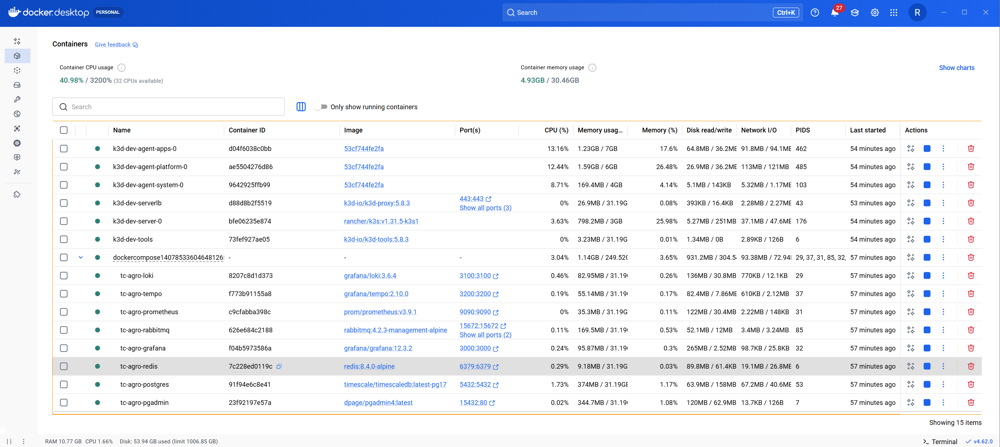

# 🌾 TC Agro Solutions - Phase 5 (Hackathon 8NETT)

**Agricultural IoT Platform with Microservices, Kubernetes & Observability**

Status: 🔵 Local development on k3d | 🟣 Azure AKS planned post-hackathon  
Deadline: February 27, 2026 | Team: 4 backend developers

---

## 📋 Table of Contents

- [🚀 START HERE](#start-here)
- [🎯 Development Environment](#development-environment)
- [🎯 Three Development Modes](#three-development-modes)
  - [🐳 Docker Compose Mode](#docker-compose-mode)
  - [🎨 Visual Studio AppHost Mode](#visual-studio-apphost-mode)
  - [☸️ K3D Mode](#k3d-mode-full-stack-gitops)
- [🚀 Quick Start](#quick-start)
- [🎨 Frontend Dashboard (PoC)](#frontend-dashboard-poc)
- [✅ Validating Your Setup](#validating-your-setup)
- [🛠️ Troubleshooting](#troubleshooting)
- [🏗️ Solution Architecture](#solution-architecture)
- [📦 Service Repositories](#service-repositories)
- [📚 Documentation](#documentation)
- [🛠️ Technology Stack](#technology-stack)
- [📅 Development Timeline](#development-timeline-phase-5)
- [🚀 Microservices](#microservices)
- [💾 Data Model](#data-model)
- [☁️ K3d Node Pool Strategy](#k3d-node-pool-strategy)
- [🔐 Security](#security)
- [📈 Observability](#observability)
- [🧪 Testing](#testing)
- [🚀 Getting Started](#getting-started)
- [🔄 Workflow Examples](#workflow-examples)
- [🤝 Contributing](#contributing)
- [📞 Support & Resources](#support-resources)

---

<a id="start-here"></a>

## 🚀 START HERE - Choose Your Entry Point

### ⚡ **Returning Developer?**

→ Use **[DEVELOPER_QUICK_REFERENCE.md](DEVELOPER_QUICK_REFERENCE.md)** _(quick commands)_

---

<a id="development-environment"></a>

## 🎯 Development Environment (Localhost - CURRENT)

**All developers work locally with k3d and Docker Compose. Zero cloud costs.**

```powershell
cd scripts\k3d
.\bootstrap.ps1  # Creates full k3d cluster + observability stack (~4 minutes)
```

**What you get:**

- ✅ k3d Kubernetes cluster (4 nodes on localhost)
- ✅ 4 microservices deployed via ArgoCD
- ✅ PostgreSQL + TimescaleDB (Docker)
- ✅ Redis (Docker)
- ✅ RabbitMQ (Docker)
- ✅ Prometheus + Grafana + Loki + Tempo + OTel (observability stack)
- ✅ Traefik ingress (k3s built-in)
- ✅ ArgoCD (GitOps controller)

**Infrastructure location:** `infrastructure/kubernetes/platform/` (k3d-optimized configs)

---

<a id="three-development-modes"></a>

## 🎯 Three Development Modes

<a id="visual-studio-apphost-mode"></a>

### 🎨 Visual Studio AppHost Mode (Recommended for Developers)

Run all services with Visual Studio's integrated orchestration - **zero configuration required**.

```powershell
# Open the orchestration solution
start orchestration\apphost-compose\TC.Agro.AppHost.Compose.slnx
# Press F5 in Visual Studio - all services start automatically with Docker containers
```

**What you get:**

- ✅ All 4 microservices running in Docker containers
- ✅ PostgreSQL + Redis + RabbitMQ (auto-configured)
- ✅ Integrated debugging (breakpoints work across services)
- ✅ Service dashboard in Visual Studio
- ✅ Auto-restart on code changes

**Best for:** Day-to-day development, debugging, quick iterations

---

<a id="docker-compose-mode"></a>

### 🐳 Docker Compose Mode (API Development)

Simple local environment for API development without Kubernetes complexity.

```powershell
docker compose up -d  # PostgreSQL + Redis + RabbitMQ
dotnet run --project services/farm-service/src/Agro.Farm.Api
```

**Best for:** Coding APIs, debugging services, database migrations

---

<a id="k3d-mode-full-stack-gitops"></a>

### ☸️ K3D Mode (Full Stack + GitOps)

Complete Kubernetes cluster with full observability stack managed via ArgoCD GitOps.

```powershell
cd scripts\k3d
.\bootstrap.ps1  # Creates cluster + ArgoCD installs everything
```

**What you get:**

- ✅ k3d cluster (4 nodes: 1 server + 3 agents)
- ✅ 🐳 Docker Hub images (public, rdpresser/\*)
- ✅ **Traefik** (k3s built-in ingress controller)
- ✅ ArgoCD (GitOps controller)
- ✅ **Auto-installed via GitOps:**
  - Prometheus + Grafana (metrics)
  - Loki (logs)
  - Tempo (traces)
  - OpenTelemetry Collector (telemetry hub)
  - KEDA (autoscaling)

**Routing (via Traefik):**

- 🌐 Frontend: `http://localhost/agro`
- 🔐 ArgoCD: `http://localhost/argocd`

**Best for:** Testing K8s deployments, validating observability, rehearsing AKS production setup

**Time:** ~4 minutes for full stack

📚 **K3D Documentation:**

- [📖 K3D GitOps Guide](scripts/k3d/README.md) - Complete workflow
- [🐳 Registry Configuration](scripts/k3d/REGISTRY_CONFIGURATION.md) - How to build & push images
- [🏗️ Architecture Diagram](scripts/k3d/ARCHITECTURE_DIAGRAM.md) - Visual overview

---

<a id="quick-start"></a>

## 🚀 Quick Start (Choose Your Mode)

### 1️⃣ Clone Repository

```powershell
git clone https://github.com/rdpresser/tc-agro-solutions.git
cd tc-agro-solutions
```

### 2️⃣ Run Bootstrap

**Windows:**

```powershell
# Clone all services and common libraries automatically
.\scripts\bootstrap.ps1
```

This will:

- Clone 4 microservices to `services/`
- Clone common libraries to `common/`
- Create `.env` files with local configuration (shared + per service)

### 3️⃣ Open Solution

**Choose one:**

```powershell
# Option A: Visual Studio AppHost (Recommended - runs everything)
start orchestration\apphost-compose\TC.Agro.AppHost.Compose.slnx

# Option B: Open individual services
start tc-agro-solutions.sln
```

### 4️⃣ Start Development

**If using AppHost (Option A):**

- Press `F5` in Visual Studio - all services start automatically ✅

**If using manual mode (Option B):**

```powershell
# Start infrastructure
docker compose up -d

# Run individual services
dotnet run --project services/farm-service/src/Agro.Farm.Api
```

**For detailed setup instructions, see [📖 Bootstrap Setup Guide](./docs/BOOTSTRAP_SETUP.md)**

---

<a id="frontend-dashboard-poc"></a>

## 🎨 Frontend Dashboard (PoC)

A modern single-page application built with Vite for fast development and hot reload.

**Location:** `poc/frontend/`

**Technology Stack:**

- ⚡ **Vite 6.0** - Lightning-fast build tool with hot module replacement
- 📊 **Chart.js** - Interactive charts for sensor data visualization
- 🔌 **SignalR** - Real-time WebSocket communication for live updates
- 🌐 **axios** - HTTP client with automatic retry logic
- 📅 **dayjs** - Lightweight date/time library

**Quick Start:**

```powershell
cd poc\frontend

# Install dependencies (first time only)
npm install

# Start development server with hot reload (recommended)
npm run dev
# Opens automatically at http://localhost:3000

# Alternative: Production build
npm run build
npm run preview

# Alternative: Simple Python server (no hot reload)
python -m http.server 8000
```

**What you get:**

- ✅ Login page (mock authentication)
- ✅ Dashboard with stats & metrics
- ✅ Properties, Plots, Sensors CRUD
- ✅ Alert management UI
- ✅ Responsive design (mobile-friendly)

**Documentation:** [poc/frontend/README.md](poc/frontend/README.md)

---

<a id="validating-your-setup"></a>

## ✅ Validating Your Setup

After running bootstrap and starting services, verify everything is working:

### Check Services

```powershell
# Check Docker containers
docker ps
# Expected: postgresql, redis, rabbitmq running

# Check .NET services (if running manually)
dotnet --list-runtimes
# Expected: .NET 10.0.x

# Test Identity API
curl http://localhost:5001/health
# Expected: HTTP 200 OK

# Test Farm API
curl http://localhost:5002/health
# Expected: HTTP 200 OK
```

### Access Points

| Component                     | Docker URL                    | K3d Url                           | Credentials              | Mode                 |
| ----------------------------- | ----------------------------- | --------------------------------- | ------------------------ | -------------------- |
| **Frontend Dashboard (Vite)** | http://localhost:3000         | -                                 | demo@agro.com / Demo@123 | npm run dev          |
| **Identity API**              | http://localhost:5001/swagger | http://localhost/identity         | -                        | Docker Compose / k3d |
| **Farm API**                  | http://localhost:5002/swagger | http://localhost/farm             | JWT required             | Docker Compose / k3d |
| **Sensor Ingest API**         | http://localhost:5003/swagger | http://localhost/sensor-ingest    | JWT required             | Docker Compose / k3d |
| **Analytics Worker**          | http://localhost:5004/health  | http://localhost/analytics-worker | -                        | Docker Compose / k3d |
| **PostgreSQL**                | localhost:5432                | -                                 | postgres/postgres        | All                  |
| **Redis**                     | localhost:6379                | -                                 | -                        | All                  |
| **RabbitMQ UI**               | http://localhost:15672        | -                                 | guest/guest              | All                  |
| **pgAdmin**                   | http://localhost:5050         | -                                 | admin / admin            | Docker Compose       |
| **Grafana**                   | http://localhost:3000         | -                                 | admin/admin              | k3d / Docker Compose |
| **Prometheus**                | http://localhost:9090         | -                                 | -                        | Docker Compose       |
| **ArgoCD**                    | http://localhost/argocd       | http://localhost/argocd           | admin/Argo@123!          | k3d only             |

**Note:** Frontend and Grafana both use port 3000 - run only one at a time, or change Vite port in `vite.config.js`.

### Verify Database

```powershell
# Connect to PostgreSQL
docker exec -it tc-agro-postgres psql -U postgres

# Check databases
\l
# Expected: identity_db, farm_db, sensor_db, analytics_db

# Exit
\q
```

---

<a id="troubleshooting"></a>

## 🛠️ Troubleshooting

### ❌ Bootstrap fails to clone repositories

**Problem:** Git authentication error or network timeout

**Solution:**

```powershell
# If using HTTPS, ensure credentials are cached
git config --global credential.helper wincred

# Or switch to SSH
# Edit scripts\bootstrap.ps1 and change HTTPS URLs to SSH
```

---

### ❌ Docker Compose fails to start

**Problem:** Port already in use (5432, 6379, 5672)

**Solution:**

```powershell
# Check what's using the port
netstat -ano | findstr :5432

# Stop conflicting service or change port in docker-compose.yml
```

---

### ❌ Visual Studio AppHost doesn't start services

**Problem:** Docker Desktop not running

**Solution:**

```powershell
# Ensure Docker Desktop is running
docker version
# If error, start Docker Desktop first
```

---

### ❌ Services can't connect to PostgreSQL

**Problem:** Connection string mismatch or database not initialized

**Solution:**

```powershell
# Check PostgreSQL is running
docker ps | findstr postgres

# Re-run migrations
cd services\farm-service
dotnet ef database update --project src\Agro.Farm.Api

# Check connection string in appsettings.Development.json
# Expected: "Host=localhost;Port=5432;Database=farm_db;Username=postgres;Password=postgres"
```

---

### ❌ k3d cluster creation fails

**Problem:** Not enough RAM or k3d not installed

**Solution:**

```powershell
# Check k3d version
k3d version
# If not found, install: choco install k3d

# Check Docker memory (needs 18GB total)
# Docker Desktop → Settings → Resources → Memory → Set to 20GB

# Delete existing cluster and retry
k3d cluster delete tc-agro-dev
cd scripts\k3d
.\bootstrap.ps1
```

---

### ❌ Frontend shows "No backend connection"

**Problem:** APIs not running or wrong URLs

**Solution:**

```javascript
// Check API URLs in poc/frontend/js/api.js
const API_BASE_URL = 'http://localhost:5001'; // Must match running service

// Ensure Identity API is running
curl http://localhost:5001/health
// If 404, start the service first
```

---

### ❌ JWT authentication fails

**Problem:** Token expired or invalid secret key

**Solution:**

```powershell
# Login again to get new token
curl -X POST http://localhost:5001/api/auth/login \
  -H "Content-Type: application/json" \
  -d '{"email":"demo@agro.com","password":"Demo@123"}'

# Check JWT secret in appsettings.Development.json (all services must match)
# "Jwt:SecretKey": "your-super-secret-key-min-32-characters"
```

---

### 🆘 Still stuck?

1. Check logs: `docker compose logs -f <service-name>`
2. Review [Local Development Setup](docs/development/local-setup.md)
3. Check [Copilot Instructions](.github/copilot-instructions.md)
4. Search issues in service repositories

---

<a id="solution-architecture"></a>

## 🏗️ Solution Architecture

### System Overview


**📐 Detailed Architecture:** See [Architecture Diagram (Draw.io)](docs/tc-agro-k3d-architecture.drawio) for full visualization.



_Docker Compose stack supporting the local k3d cluster services._

---

### Parent Repository (this repo)

```
tc-agro-solutions/
├── services/                   # 🔄 Cloned by bootstrap.ps1
│   ├── identity-service/       # Authentication & JWT
│   ├── farm-service/           # Properties & Plots management
│   ├── sensor-ingest-service/  # IoT data ingestion
│   └── analytics-worker/       # Alerts & rules engine
├── common/                     # 🔄 Cloned by bootstrap.ps1 (shared libraries)
├── poc/
│   └── frontend/               # 🌐 HTML/CSS/JS dashboard (no backend required)
├── orchestration/
│   └── apphost-compose/
│       ├── TC.Agro.AppHost.Compose.slnx  # 🎨 Visual Studio orchestration
│       ├── docker-compose.yml            # 🐳 Infrastructure services
│       └── .env                          # 🔄 Created by bootstrap (shared config)
├── infrastructure/
│   ├── terraform/              # 🟣 Azure AKS IaC (future)
│   └── kubernetes/             # ☸️ k3d manifests + ArgoCD apps (current)
├── scripts/
│   ├── bootstrap.ps1           # ⚙️ Clone services automation
│   └── k3d/                    # k3d cluster scripts
│       └── bootstrap.ps1       # ☸️ Create k3d cluster + ArgoCD
├── docs/                       # Architecture & ADRs
│   ├── adr/                    # Architectural Decision Records
│   ├── architecture/           # C4 diagrams & guides
│   │   └── tc-agro-k3d-architecture.drawio  # 📐 Main architecture diagram
│   └── development/            # Developer guides
└── DEVELOPER_QUICK_REFERENCE.md  # 🚀 Common commands cheat sheet
```

---

<a id="service-repositories"></a>

## � Service Repositories

### Microservices (4 independent repositories)

| Service              | Repository                    | Folder                           | Purpose              |
| -------------------- | ----------------------------- | -------------------------------- | -------------------- |
| **Identity**         | tc-agro-identity-service      | `services/identity-service`      | Authentication & JWT |
| **Farm**             | tc-agro-farm-service          | `services/farm-service`          | Properties & Plots   |
| **Sensor Ingest**    | tc-agro-sensor-ingest-service | `services/sensor-ingest-service` | Data ingestion API   |
| **Analytics Worker** | tc-agro-analytics-worker      | `services/analytics-worker`      | Rules & alerts       |

### Common Libraries

| Repository         | Folder    | Purpose                                     |
| ------------------ | --------- | ------------------------------------------- |
| **tc-agro-common** | `common/` | Shared utilities, validators, domain models |

**All services are cloned automatically by `bootstrap.ps1`**

---

## 🏗️ Key Documentation

### For Developers (First Time)

- **[🚀 Bootstrap Setup Guide](docs/BOOTSTRAP_SETUP.md)** - Quick setup with `bootstrap.ps1`
- **[🐳 Local Development Setup](docs/development/local-setup.md)** - Docker Compose guide
- **[🤖 Copilot Instructions](.github/copilot-instructions.md)** - Coding standards

### For Architects / Tech Leads

<a id="documentation"></a>

## 📚 Documentation

### Getting Started

- **[🚀 Developer Quick Reference](DEVELOPER_QUICK_REFERENCE.md)** - Most common commands cheat sheet ⭐ **FASTEST START**
- **[🚀 Bootstrap Setup Guide](docs/BOOTSTRAP_SETUP.md)** - Quick setup with `bootstrap.ps1`
- **[🧑‍💻 Local Development](docs/development/local-setup.md)** - Detailed local environment guide

### Architecture & Design

- **[🗺️ Technical Roadmap](README_ROADMAP.md)** - Complete strategy, phases, deliverables
- **[✅ Requirements Mapping](docs/REQUIREMENTS_MAPPING.md)** - Hackathon spec → roadmap traceability
- **[📋 Architectural Decision Records (ADRs)](docs/adr/)** - All decisions (001-007)
- **[📊 C4 Diagrams](docs/architecture/)** - System context + container diagrams

### Infrastructure & Deployment

- **[🏗️ Terraform Infrastructure Guide](docs/architecture/infrastructure-terraform.md)** - IaC implementation
- **[⚙️ K3d Node Pool Strategy](docs/adr/ADR-007-node-pool-strategy.md)** - Performance + cost optimization
- **[📖 Node Pool Quick Reference](terraform/AKS_NODE_POOLS_REFERENCE.md)** - Ready-to-use HCL

### Development

- **[📝 New Microservice Template](NEW_MICROSERVICE_TEMPLATE.md)** - Step-by-step checklist

---

<a id="technology-stack"></a>

## 🛠️ Technology Stack

### Backend

| Category          | Technology            | Version |
| ----------------- | --------------------- | ------- |
| **Runtime**       | .NET                  | 10.0    |
| **Language**      | C#                    | 14.0    |
| **API Framework** | FastEndpoints         | 7.2     |
| **ORM**           | Entity Framework Core | 10.0    |
| **Messaging**     | Wolverine             | 5.15    |
| **Pattern**       | Pragmatic CQRS        | -       |

### Infrastructure (Production - Azure - Future)

| Component         | Technology                                     | Purpose                       |
| ----------------- | ---------------------------------------------- | ----------------------------- |
| **Orchestration** | Azure Kubernetes Service (AKS)                 | Container orchestration       |
| **Database**      | Azure PostgreSQL Flexible Server + TimescaleDB | Relational + time-series data |
| **Cache**         | Azure Redis Cache                              | Distributed caching           |
| **Messaging**     | Azure Service Bus                              | Async communication           |
| **Registry**      | Azure Container Registry (ACR)                 | Docker images                 |
| **Observability** | Application Insights + Log Analytics           | APM & logging                 |
| **IaC**           | Terraform                                      | Infrastructure as Code        |

### Local Development

| Component               | Technology                                          | Mode            |
| ----------------------- | --------------------------------------------------- | --------------- |
| **Orchestration**       | Visual Studio AppHost / Docker Compose / k3d        | 🎨 / 🐳 / ☸️    |
| **Database**            | PostgreSQL 16 + TimescaleDB                         | Docker          |
| **Cache**               | Redis 7                                             | Docker          |
| **Messaging**           | RabbitMQ 4.0                                        | Docker          |
| **Observability (k3d)** | Prometheus + Grafana + Loki + Tempo + OpenTelemetry | GitOps          |
| **GitOps (k3d)**        | ArgoCD                                              | Auto-deployment |
| **Ingress (k3d)**       | Traefik                                             | k3s built-in    |

### Frontend

| Component       | Technology                             | Purpose                                  |
| --------------- | -------------------------------------- | ---------------------------------------- |
| **Build Tool**  | Vite 6.0                               | Fast development server with hot reload  |
| **UI**          | HTML5 + CSS3 + JavaScript (ES Modules) | Responsive dashboard                     |
| **HTTP Client** | axios 1.7                              | REST API communication with retry logic  |
| **Charts**      | Chart.js 4.4                           | Interactive data visualization           |
| **Date/Time**   | dayjs 1.11                             | Lightweight date manipulation            |
| **Real-time**   | SignalR Client 9.0                     | WebSocket communication for live updates |
| **Icons**       | Unicode Emoji                          | No external dependencies                 |
| **Dev Server**  | Vite Dev Server / Python HTTP Server   | Local development                        |

### Testing & Quality

| Category              | Technology               |
| --------------------- | ------------------------ |
| **Unit Tests**        | xUnit 3.2                |
| **Mocking**           | NSubstitute / FakeItEasy |
| **Integration Tests** | FastEndpoints.Testing    |
| **Load Tests**        | k6                       |
| **Code Quality**      | SonarQube (planned)      |

**Choose your mode:**

- 🐳 **Docker Compose + Manual Run** → Daily development (recommended)
- 🎨 **Visual Studio AppHost** → Integrated debugging (all services together)
- ☸️ **k3d Cluster** → Professional testing (production-like K8s)

**Quick Start Docker Compose (Recommended):**

```powershell
cd orchestration\apphost-compose
docker compose up -d
cd ..\..\services\identity-service
dotnet run --project src\Agro.Identity.Api
```

**Quick Start AppHost (All-in-One):**

```powershell
start orchestration\apphost-compose\TC.Agro.AppHost.Compose.slnx
# Press F5 - everything starts automatically
```

**Quick Start k3d (Professional):**

```powershell
cd scripts\k3d
.\bootstrap.ps1
# Wait ~4 minutes - ArgoCD deploys full stack via GitOps
```

📚 **See [K3D GitOps Guide](scripts/k3d/README.md)** for detailed workflow.

---

<a id="development-timeline-phase-5"></a>

## 📅 Development Timeline (Phase 5)

| Phase       | Duration  | Focus                                            |
| ----------- | --------- | ------------------------------------------------ |
| **Phase 0** | Week 1    | Infra setup, code structure, local environment   |
| **Phase 1** | Weeks 1-2 | Domain structure, API design, database schema    |
| **Phase 2** | Weeks 2-3 | Data modeling, performance testing, aggregations |
| **Phase 3** | Weeks 3-4 | Ingestion endpoints, alerts worker, dashboards   |
| **Phase 4** | Weeks 4-5 | Code quality, observability, testing             |
| **Phase 5** | Weeks 5-6 | Integrated demo, dashboards, presentation        |

---

<a id="microservices"></a>

## 🚀 Microservices

### 🔐 Agro.Identity.Api

Authentication, authorization, user management via JWT tokens.

**Repo:** `git@github.com:your-org/agro-identity-service.git`

### 🌾 Agro.Farm.Api

Properties, plots, sensors management (CRUD with caching).

**Repo:** `git@github.com:your-org/agro-farm-service.git`

### 📡 Agro.Sensor.Ingest.Api

Receives sensor data, validates, persists to TimescaleDB, publishes events.

**Repo:** `git@github.com:your-org/agro-sensor-ingest-service.git`

### 📈 Agro.Analytics.Worker

Consumes events, applies rules, generates alerts (background worker).

**Repo:** `git@github.com:your-org/agro-analytics-worker.git`

---

<a id="data-model"></a>

## 💾 Data Model

### Core Tables

```
Identity
├── Users (email, password_hash, status)
├── Roles (name)
└── UserRoles (user_id, role_id)

Farm
├── Properties (name, location, owner)
├── Plots (property_id, name, crop_type, area)
└── Sensors (plot_id, type, status)

Sensor Data (TimescaleDB Hypertable)
├── sensor_readings (time, sensor_id, temperature, humidity, soil_moisture)

Analytics
├── Rules (plot_id, metric, condition, threshold)
├── Alerts (rule_id, timestamp, message, status)
└── AuditLog (entity, action, user_id, timestamp)
```

---

<a id="k3d-node-pool-strategy"></a>

## K3d Node Pool Strategy

Four optimized node pools for stability and performance, for localhost dev:

| Pool            | Memory | Workload                    |
| --------------- | ------ | --------------------------- |
| **server-core** | 3gb    | Kubernetes control plane    |
| **system**      | 4gb    | Kubernetes infrastructure   |
| **platform**    | 6gb    | ArgoCD, Ingress             |
| **apps**        | 7gb    | .NET APIs worloads, workers |

**Est. Cost:** $0/month

## AKS Node Pool Strategy (Production - Future)

Three optimized node pools for stability, performance, and cost:

| Pool         | SKU        | Min-Max | Workload                      |
| ------------ | ---------- | ------- | ----------------------------- |
| **system**   | B2ms (8GB) | 1-2     | Kubernetes infrastructure     |
| **platform** | B2s (4GB)  | 1-3     | ArgoCD, Ingress, cert-manager |
| **worker**   | B2s (4GB)  | 2-5     | .NET APIs, workers            |

**Est. Cost:** $375–575/month  
**Details:** [ADR-007: AKS Node Pool Strategy](docs/adr/ADR-007-node-pool-strategy.md)

---

<a id="security"></a>

## 🔐 Security

### JWT Authentication

All APIs protected with JWT Bearer tokens (except login endpoint).

### Validation

FluentValidation on all endpoints.

### Secrets Management

Azure Key Vault for production secrets.

### Network

- APIs behind Ingress Controller
- Service-to-service via Kubernetes DNS
- External requests only via Ingress

---

<a id="observability"></a>

## 📈 Observability

### Application Insights

- Custom metrics (ingestion rate, processing time)
- Distributed tracing (correlation IDs)
- Dependency tracking

### Log Analytics

- Centralized logs from all services
- KQL queries for analysis

### Azure Monitor Workbooks

- Real-time system health dashboard
- Alert status and trends
- Query performance metrics

---

<a id="testing"></a>

## 🧪 Testing

### Unit Tests

xUnit with NSubstitute/Moq for each service.

### Integration Tests

API endpoint tests with in-memory database.

### Load Tests

k6 simulating 100+ sensors with continuous readings.

### Smoke Tests

Automated post-deployment validation.

---

## 📚 Documentation Structure

```
docs/
├── adr/                          # Architectural Decision Records
│   ├── ADR-001-microservices.md
│   ├── ADR-002-persistence.md
│   ├── ADR-003-timeseries.md
│   ├── ADR-004-observability.md
│   ├── ADR-005-local-vs-cloud.md
│   ├── ADR-006-local-orchestration.md
│   └── ADR-007-node-pool-strategy.md
├── architecture/                 # Architecture Documentation
│   ├── c4-context.md
│   ├── c4-container.md
│   ├── infrastructure-terraform.md
│   └── data-model.md
└── development/                  # Developer Guides
    ├── local-setup.md
    ├── api-conventions.md
    ├── testing-strategy.md
    └── deployment-checklist.md
```

---

<a id="getting-started"></a>

## 🚀 Getting Started

### For Developers

1. Clone solution: `.\scripts\bootstrap.ps1`
2. Start local env: `docker-compose up -d`
3. Read [Local Development Setup](docs/development/local-setup.md)
4. Check [Copilot Instructions](.github/copilot-instructions.md)

### For DevOps/Infrastructure

1. Review [Terraform Guide](docs/architecture/infrastructure-terraform.md)
2. Read [Node Pool Strategy](docs/adr/ADR-007-node-pool-strategy.md)
3. Check [Node Pool Reference](terraform/AKS_NODE_POOLS_REFERENCE.md)
4. Deploy: `cd infrastructure && terraform apply`

### For Team Leads

1. Review [Technical Roadmap](README_ROADMAP.md)
2. Review all [ADRs](docs/adr/) for decision context
3. Check [Architecture Documentation](docs/architecture/)

---

<a id="workflow-examples"></a>

## 🔄 Workflow Examples

### Adding a New Microservice

1. Create new repository: `agro-new-service`
2. Clone it into `services/` folder locally
3. Add Kubernetes manifest in `infrastructure/kubernetes/`
4. Configure in ArgoCD
5. Commit: `git add . && git commit -m "feat: add new microservice"`

### Deploying a Service Update

1. Developer creates PR in service repo
2. Service repo CI/CD runs tests, builds Docker image
3. After merge, new image is deployed via ArgoCD

### Local Development with Service Changes

```bash
# Clone solution
git clone <url>
cd tc-agro-solutions

# Make changes in a service
cd services/agro-farm-service
# ... edit code ...

# Build and run locally
docker-compose build agro-farm-service
docker-compose up -d agro-farm-service

# Test via http://localhost:5002
```

---

<a id="contributing"></a>

## 🤝 Contributing

### Branch Naming

- Feature: `feature/description`
- Bugfix: `bugfix/description`
- Hotfix: `hotfix/description`

### Commit Messages

```
feat: add new endpoint
fix: resolve timeout issue
chore: update dependencies
docs: add ADR for decision
refactor: simplify query logic
test: add integration test
```

### Code Review

- All changes via pull request
- Minimum 1 approval required
- CI/CD must pass
- ADR required for architectural changes

---

<a id="support-resources"></a>

## 📞 Support & Resources

### Documentation

- [Technical Roadmap](README_ROADMAP.md)
- [Bootstrap Setup](docs/BOOTSTRAP_SETUP.md)
- [All ADRs](docs/adr/)
- [Copilot Instructions](.github/copilot-instructions.md)

### External Resources

- [FastEndpoints](https://fast-endpoints.com/)
- [Wolverine](https://wolverine.netlify.app/)
- [TimescaleDB](https://docs.timescale.com/)
- [Azure AKS](https://learn.microsoft.com/azure/aks/)
- [Terraform](https://www.terraform.io/)

---

## 📝 License

This project is proprietary. All rights reserved.

---

## ✨ Key Metrics

- **Services:** 4 microservices
- **Repositories:** Independent git repositories per service
- **Documentation:** 7 ADRs + architecture guides
- **Test Coverage:** Unit, integration, load, smoke tests
- **Deployment:** Azure AKS via Terraform + ArgoCD

---

> **Version:** 2.3 - Corrected development modes, file paths, and documentation structure  
> **Last Updated:** January 18, 2026  
> **Status:** Production-ready for Phase 5 delivery  
> **Deadline:** February 27, 2026 ✅
