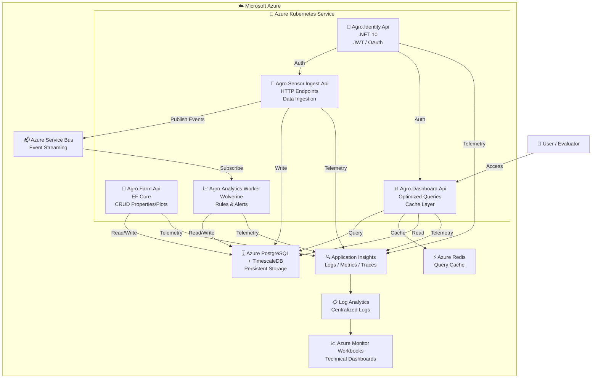

# 🚀 Technical Roadmap - Phase 5: Hackathon 8NETT

## Development on Localhost (k3d) • Production on Azure (Future)

---

## 🎯 At a Glance

| Aspect         | 🔵 NOW (Localhost Development)        | 🟣 FUTURE (Azure Production)              |
| -------------- | ------------------------------------- | ----------------------------------------- |
| **Where?**     | Your laptop (all developers)          | Cloud (post-hackathon)                    |
| **Kubernetes** | k3d (lightweight local cluster)       | AKS (managed Azure service)               |
| **Database**   | PostgreSQL (Docker)                   | Azure PostgreSQL Flexible Server          |
| **Messaging**  | RabbitMQ (Docker)                     | Azure Service Bus                         |
| **Cache**      | Redis (Docker)                        | Azure Redis Cache                         |
| **Telemetry**  | Prometheus/Grafana/Loki/OTel (Docker) | Application Insights/Log Analytics        |
| **Cost**       | $0                                    | Azure subscription required               |
| **Status**     | ✅ Active & Used Daily                | 📋 Documented (terraform/) - Not deployed |

---

## 📊 Current Architecture Overview (Localhost - k3d + Docker Compose)



---

## 🎯 1. Context and Objective

**Phase 5 (Current):** Build and demonstrate microservices platform running locally on k3d with complete observability.

| Aspect            | Details                                                                           |
| ----------------- | --------------------------------------------------------------------------------- |
| ⏰ Final deadline | **February 27, 2026**                                                             |
| 👥 Team           | **4 backend developers**                                                          |
| 🌍 Development    | **k3d + Docker Compose (Localhost)**                                              |
| 🎯 Primary Focus  | **realistic, well-architected, observable delivery**                              |
| 📊 Deliverables   | Working system on k3d, health checks, observability dashboards, GitOps validation |

**Objective:** Deliver a fully functional system demonstrating:

- ✅ 5 microservices running in k3d Kubernetes
- ✅ Complete observability (Prometheus, Grafana, Loki, Tempo, OTel)
- ✅ GitOps workflows with ArgoCD
- ✅ Event-driven architecture with RabbitMQ
- ✅ Time-series data with PostgreSQL + TimescaleDB
- ✅ Sensor ingestion, alert engine, dashboard

**Post-Hackathon (Future):** Proven architecture migrates to Azure AKS using Terraform IaC (documented, not deployed during Phase 5).

---

## ⚙️ 2. Assumptions and Constraints

| Assumption                | Description                                                                  |
| ------------------------- | ---------------------------------------------------------------------------- |
| 🎨 Frontend               | No dedicated complex frontend                                                |
| 📊 Data                   | Sensor data can be simulated                                                 |
| ✅ Evaluation prioritizes | • Architecture<br>• Observability<br>• Infrastructure<br>• Technical clarity |
| 🛑 Avoid                  | Large structural changes                                                     |
| 📈 Prioritize             | **Delivered value** and **quality**                                          |

---

## 🛠️ 3. Adopted Technology Stack

### 💾 Backend

```
├── C# / .NET 10
├── FastEndpoints
├── Pragmatic CQRS
├── Wolverine (messaging and handlers)
└── EF Core
```

### ☁️ Infrastructure

```
├── Azure Kubernetes Service (AKS)
├── Azure Container Registry (ACR)
├── Azure Service Bus
├── Azure PostgreSQL Flexible Server
├── Redis Cache
└── Azure Key Vault
```

### 📊 Observability and Operations

```
├── Application Insights
├── Log Analytics
├── Azure Monitor Workbooks
├── k6 (load and smoke tests)
├── GitHub Actions
├── Terraform (IaC)
└── ArgoCD (GitOps)
```

---

## 🏗️ 4. Architectural Decisions

### 4.1 🔄 Microservices

Architecture based on **independent microservices**, each with its own logical database.

#### Proposed Services:

| Service                       | Function                         | Responsibility                               |
| ----------------------------- | -------------------------------- | -------------------------------------------- |
| 🔐 **Agro.Identity.Api**      | Authentication and authorization | Manage users, JWT tokens                     |
| 🌾 **Agro.Farm.Api**          | Properties and plots             | CRUD of properties, plots, configurations    |
| 📡 **Agro.Sensor.Ingest.Api** | Data ingestion                   | Receive sensor data, publish to Service Bus  |
| 📈 **Agro.Analytics.Worker**  | Rules and alerts                 | Process events, apply rules, generate alerts |
| 📊 **Agro.Dashboard.Api**     | Queries and read                 | Optimized reads for dashboards, cache        |

---

### 4.2 📝 Pragmatic CQRS

```
┌─────────────────────────────────┐
│             Write               │
│        APIs and Workers         │
└─────────────────────────────────┘
         ↓
    (no extreme segregation)
         ↓
┌─────────────────────────────────┐
│             Read                │
│        Dashboard.Api            │
└─────────────────────────────────┘

🎯 Focus: Clarity and delivery speed
```

---

### 4.3 🗄️ EF Core vs Event Sourcing

| Case             | Decision              | Note               |
| ---------------- | --------------------- | ------------------ |
| 🔧 Simple CRUD   | **EF Core**           | Recommended        |
| 📋 High auditing | Marten (optional)     | If needed          |
| ⏱️ Time series   | EF Core + TimescaleDB | Better performance |

> **Note:** For this project, **event sourcing is not mandatory** and would be overengineering.

---

## ⏰ 5. Time Series and TimescaleDB

### 5.1 📊 What is Time Series

Data whose primary axis is **time**:

#### Characteristics:

- 📡 Sensor readings
- 📈 Continuous metrics
- 📚 Historical data for dashboards
- ⏱️ Temperature per minute
- 💧 Humidity every 15 minutes
- 🌾 Stock price per day

#### Conceptual format:

```
[timestamp] → [sensor_value]
[timestamp] → [sensor_value]
[timestamp] → [sensor_value]
Real domain example:
2025-01-01 10:01 | Sensor123 | 28.5
2025-01-01 10:02 | Sensor123 | 28.6
```

### 5.2 ❓ Why a "normal" relational database with a big table falls short?

**Problem:** Inserting 1 million records/day into a common SQL table:

- 📊 Indexes become slow
- 💾 Storage becomes inefficient
- 🔍 Historical queries stall
- 🗑️ Cleaning old data is complicated

### 5.3 🎯 What is TimescaleDB?

**TimescaleDB is a PostgreSQL extension**, specifically optimized for time series.

Behavior:

- Partitions data by time ("hypertables")
- Automatic compression for history
- Super fast aggregations (avg, sum, etc.)
- Automatic retention ("keep using normal SQL")

#### Why/when to use TimescaleDB?

| Criterion                                     | Use TimescaleDB?             |
| --------------------------------------------- | ---------------------------- |
| 🔧 Less than 100k records/day                 | No, normal Postgres suffices |
| 📊 100k - 10M records/day                     | **YES**                      |
| 💾 More than 10M records/day                  | **YES, STRONGLY**            |
| 📈 Needs period aggregations (hour/day/month) | **YES**                      |
| 🔍 Needs to query 1+ year of history          | **YES**                      |

### 5.4 🚀 TimescaleDB and NuGet? Library? Where does it fit?

It is not a NuGet. TimescaleDB is a **database** (PostgreSQL extension running on Azure PostgreSQL Flexible Server).

You:

- It is not a C# library.
- You enable it on Azure PostgreSQL by enabling the extension.
- EF Core accesses it normally (tables look like common big tables).
- Use raw SQL for advanced queries (time aggregations).

#### Which use case fits the AI?

**Yes. It is perfect for sensor readings.**

Real domain example:

```sql
-- TimescaleDB does this very fast:
SELECT
  time_bucket('1 hour', time) AS hour,
  AVG(temperature) AS avg_temp,
  MAX(humidity) AS max_humidity
FROM sensor_readings
WHERE sensor_id = 'Sensor123'
  AND time > now() - interval '30 days'
GROUP BY hour
ORDER BY hour DESC;
```

### 5.5 🔄 Expected data flow sensor → TimescaleDB → Dashboard

```
Physical sensor (simulated)
         ↓
Agro.Sensor.Ingest.Api (receives HTTP)
         ↓
Persist to TimescaleDB (sensor_readings hypertable)
         ↓
Agro.Analytics.Worker (consumes event, applies rules)
         ↓
Dashboard.Api (reads history and aggregations)
         ↓
Azure Monitor Workbooks (visualizes)
```

---

## 📋 6. Database Structure

### 6.1 📊 Main Tables

#### 📋 Identity

- **Users** (id, email, password_hash, status)
- **Roles** (id, name)
- **UserRoles** (user_id, role_id)

#### 🌾 Farm

- **Properties** (id, name, location, owner)
- **Plots** (id, property_id, name, area, crop_type)
- **Sensors** (id, plot_id, type, status)

#### 📡 Sensor Data (TimescaleDB)

- **sensor_readings** (hypertable: time, sensor_id, temperature, humidity, soil_moisture, value)

#### 📈 Analytics & Alerts

- **Rules** (id, plot_id, metric, condition, threshold, action)
- **Alerts** (id, rule_id, timestamp, message, status)
- **AuditLog** (id, entity, action, timestamp, user_id)

### 6.2 🔌 Main Endpoints

#### 🔐 Identity

- `POST /auth/login` → JWT token
- `POST /auth/refresh` → new token
- `POST /users` → create user
- `GET /users/{id}` → user data

#### 🌾 Farm

- `GET /properties` → list properties
- `POST /properties` → create property
- `GET /plots/{propertyId}` → list plots
- `POST /plots` → create plot
- `GET /sensors/{plotId}` → list sensors

#### 📡 Ingest

- `POST /sensors/readings` → insert reading
- `POST /sensors/batch` → insert batch
- Example:
  ```json
  {
    "sensorId": "Sensor123",
    "timestamp": "2025-01-08T10:30:00Z",
    "temperature": 28.5,
    "humidity": 65.2,
    "soilMoisture": 42.1
  }
  ```

#### 📊 Dashboard

- `GET /dashboard/latest?pageNumber=1&pageSize=10` → latest readings (paginated)
- `GET /api/sensors/{sensorId}/readings?days=7&pageNumber=1&pageSize=10` → history (paginated)
- `GET /dashboard/analytics/{plotId}` → aggregated analyses
- `GET /alerts/pending` → pending alerts

---

## 🎯 7. Critical Architectural Decisions (ADRs)

This section has been organized into dedicated ADR documents:

- [ADR-001: Microservices-based Architecture](docs/adr/ADR-001-microservices.md)
- [ADR-002: Data Persistence Strategy](docs/adr/ADR-002-persistence.md)
- [ADR-003: Use of Time Series with TimescaleDB](docs/adr/ADR-003-timeseries.md)
- [ADR-004: Observability and Dashboards](docs/adr/ADR-004-observability.md)
- [ADR-005: Local vs Cloud Development Strategy](docs/adr/ADR-005-local-vs-cloud.md)
- [ADR-006: Local Orchestration – .NET Aspire vs Docker Compose](docs/adr/ADR-006-local-orchestration.md)
- [ADR-007: AKS Node Pool Strategy](docs/adr/ADR-007-node-pool-strategy.md)

---

## 🏗️ 8. C4 Diagrams - Architecture Language

These diagrams are now in the architecture documentation:

- [C4 Level 1: Context Diagram](docs/architecture/c4-context.md)
- [C4 Level 2: Container Diagram](docs/architecture/c4-container.md)

---

## 📅 9. Development Timeline by Phase

### 🔵 Phase 0 – Preparation and Structure (Week 1)

**Status:** 🟢 Initial preparation

#### Checklist

- ✅ Structure repository (monorepo vs multi-repo)
- ✅ Configure Azure DevOps / GitHub Actions pipeline
- ✅ Define coding conventions (C# style guide)
- ✅ Local development setup (Docker, .NET 10)
- ✅ Create initial documentation (README, CONTRIBUTING)
- ✅ Draw C4 and ADRs
- ✅ Provision Azure resources (ACR, AKS, PostgreSQL, Service Bus)

---

### 🔵 Phase 1 – Real Requirements Structure (Week 1-2)

**Focus:** Structure domain and specify data

#### 1.1 Requirements Gathering

- ✅ Understand data flow (sensor → ingestion → alerts → dashboard)
- ✅ Define business models (Property, Plot, Sensor)
- ✅ List collected metrics (temperature, humidity, soil, etc.)
- ✅ Specify alert rules
- ✅ Document data retention periods

#### 1.2 API and Domain Structure

- ✅ Create .NET projects (Identity, Farm, Ingest, Analytics, Dashboard)
- ✅ Define DTOs (Data Transfer Objects)
- ✅ Model domain entities
- ✅ Setup FastEndpoints in each project
- ✅ Configure EF Core DbContext

#### 1.3 Database Schema

- ✅ Create migrations (Identity, Farm, Sensors)
- ✅ Define primary keys, foreign keys
- ✅ Create TimescaleDB hypertable for sensor_readings
- ✅ Indexes for frequent queries
- ✅ Seeders for test data

---

### 🔵 Phase 2 – Data Problem and Dimensionality (Week 2-3)

**Focus:** Understand volume and aggregation challenges

#### 2.1 Sensor Dimensionality

- ✅ How many sensors? (10, 100, 1000?)
- ✅ Reading frequency? (1/min, 1/5min, 1/15min?)
- ✅ How many years of retention?
- ✅ Metrics to aggregate? (avg, max, min, stddev)

#### 2.2 Ingestion Performance

- ✅ Load test: simulated insertion
- ✅ Measure latency P50, P99
- ✅ Validate indexes in TimescaleDB
- ✅ Implement batch processing if needed

#### 2.3 Query Performance

- ✅ Historical queries (last 7 days, 30 days, 1 year)
- ✅ Aggregations per period (hour, day, week)
- ✅ Validate execution plan with EXPLAIN
- ✅ Implement Redis caching for hot queries

#### 2.4 Retention and Compression

- ✅ Configure TimescaleDB compression policy (e.g., 7 days)
- ✅ Implement routine to clean old data
- ✅ Validate storage savings

---

### 🔵 Phase 3 – Query / Alerts (Week 3-4)

**Focus:** Implement business logic

#### 3.1 Ingestion Endpoints

```
POST /sensors/readings
Content-Type: application/json

{
  "sensorId": "Sensor123",
  "timestamp": "2025-01-08T10:30:00Z",
  "temperature": 28.5,
  "humidity": 65.2,
  "soilMoisture": 42.1,
  "rainfall": 0.0
}

✅ Validate input
✅ Persist to TimescaleDB
✅ Publish event to Service Bus
✅ Return 202 Accepted
```

#### 3.2 Alerts Worker (Wolverine)

- ✅ Consume Ingest events via Service Bus
- ✅ Apply rules (e.g., temperature > 35°C)
- ✅ Generate alerts (CREATE in Alerts table)
- ✅ Publish to notifications topic (optional: Logic Apps)

#### 3.3 Dashboard Queries

```
GET /dashboard/latest?pageNumber=1&pageSize=10
Response:
{
  "data": [
    {
      "sensorId": "Sensor123",
      "plotId": "Plot1",
      "time": "2025-01-08T10:30:00Z",
      "temperature": 28.5,
      "humidity": 65.2,
      "soilMoisture": 42.1
    }
  ],
  "totalCount": 1,
  "pageNumber": 1,
  "pageSize": 10
}

✅ Read from Redis cache (TTL 5 min)
✅ If miss, query DB
✅ Update cache
✅ Return JSON
✅ Compute plot status badge from alert rules (e.g., soil moisture < 30% for 24h ⇒ "Dry Alert")
```

#### 3.4 Aggregated Queries

```sql
-- TimescaleDB aggregation
SELECT
  time_bucket('1 hour', time) AS hour,
  AVG(temperature) AS avg_temp,
  MAX(temperature) AS max_temp,
  MIN(temperature) AS min_temp
FROM sensor_readings
WHERE sensor_id = 'Sensor123'
  AND time > now() - interval '7 days'
GROUP BY hour
ORDER BY hour DESC;
```

---

### 🔵 Phase 4 – Proposed Architecture (Definition and Elegance) (Week 4-5)

**Focus:** Polish code, patterns, observability

#### 4.1 Coding Standards

- ✅ Pragmatic CQRS (Commands and Queries separated where it makes sense)
- ✅ Domain handlers (use Wolverine)
- ✅ Validation with FluentValidation
- ✅ Centralized exception handling
- ✅ Structured logging (with Application Insights)

#### 4.2 Observability

- ✅ Instrument all services with Application Insights SDK
- ✅ Add custom metrics (ingestion time, alerts generated)
- ✅ Distributed tracing (correlate logs across services)
- ✅ Create Workbooks to visualize system health

#### 4.3 Testing

- ✅ Unit tests (validation, handlers)
- ✅ Integration tests (API endpoints)
- ✅ Load tests with k6 (simulate 1000 sensors)
- ✅ Smoke tests post-deploy

#### 4.4 Documentation

- ✅ OpenAPI (Swagger) for each API
- ✅ ADR documentation
- ✅ Operations playbooks
- ✅ Troubleshooting guide

---

### 🟢 Phase 5 – Integrated Demo and Observability (Week 5-6)

**Focus:** Final delivery, dashboards, presentation

#### 5.1 Business Dashboards

- ✅ Dashboard.Api returning real-time data
- ✅ Azure Monitor Workbooks showing:
  - Alerts per plot
  - Temperature/humidity trends
  - Ingestion rate
  - Processing latency

#### 5.2 Performance & Scale

- ✅ Simulate 100 sensors × 1 reading/min
- ✅ Generate 144k events/day
- ✅ Validate SLA: ingestion < 100ms, query < 500ms
- ✅ Document load test results

#### 5.3 Technical Presentation

- ✅ Live ingestion demo
- ✅ Show dashboards working
- ✅ Explain architectural decisions (ADRs)
- ✅ Present C4 diagrams
- ✅ Discuss observability and scalability

#### 5.4 Clean and Documented Code

- ✅ Final code review
- ✅ Refactor duplicated code
- ✅ README updated with deployment instructions
- ✅ IaC (Terraform) versioned and commented

---

## 📊 10. Technical Details per Service

### 🔐 Agro.Identity.Api

**Responsibility:** Authentication, authorization, user management

#### Stack

- FastEndpoints
- JWT Bearer
- EF Core + PostgreSQL

#### Endpoints

```
POST   /auth/login          → JWT token
POST   /auth/refresh        → New token
POST   /users               → Create user
GET    /users/{id}          → Get user
PUT    /users/{id}          → Update user
DELETE /users/{id}          → Delete user
```

#### Data Model

```csharp
public class User
{
    public Guid Id { get; set; }
    public string Email { get; set; }
    public string PasswordHash { get; set; }
    public bool Active { get; set; }
    public DateTime CreatedAt { get; set; }
}
```

---

### 🌾 Agro.Farm.Api

**Responsibility:** Management of properties, plots, sensors

#### Stack

- FastEndpoints
- EF Core + PostgreSQL
- Redis Cache (catalog read)

#### Endpoints

```
GET    /properties               → List all properties
POST   /properties               → Create property
GET    /properties/{id}          → Get property details
PUT    /properties/{id}          → Update property

GET    /properties/{id}/plots    → List plots
POST   /plots                    → Create plot
PUT    /plots/{id}               → Update plot

GET    /plots/{id}/sensors       → List sensors
POST   /sensors                  → Create sensor
PUT    /sensors/{id}             → Update sensor status
```

#### Models

```csharp
public class Property
{
    public Guid Id { get; set; }
    public string Name { get; set; }
    public string Location { get; set; }
    public double AreaHectares { get; set; }
    public Guid OwnerId { get; set; }
}

public class Plot
{
    public Guid Id { get; set; }
    public Guid PropertyId { get; set; }
    public string Name { get; set; }
    public string CropType { get; set; }
    public double AreaHectares { get; set; }
}

public class Sensor
{
    public string Id { get; set; }
    public Guid PlotId { get; set; }
    public string Type { get; set; }  // "Temperature", "Humidity", "SoilMoisture"
    public string Status { get; set; } // "Active", "Inactive"
}
```

---

### 📡 Agro.Sensor.Ingest.Api

**Responsibility:** Receive sensor data, persist, publish events

#### Stack

- FastEndpoints
- EF Core + TimescaleDB
- Azure Service Bus (publisher)
- JWT-protected ingestion endpoints
- Input validation

#### Main Endpoint

```
POST /sensors/readings

Request:
{
  "sensorId": "Sensor123",
  "timestamp": "2025-01-08T10:30:00Z",
  "temperature": 28.5,
  "humidity": 65.2,
  "soilMoisture": 42.1,
  "rainfall": 0.0
}

Response: 202 Accepted
{
  "readingId": "uuid",
  "message": "Reading received"
}
```

#### Batch Endpoint

```
POST /sensors/batch

Request: Array of readings

Response: 202 Accepted with processed count
```

#### Flow

0. Enforce JWT on all ingestion endpoints
1. Validate input (schema, limits)
2. Persist to sensor_readings (TimescaleDB hypertable)
3. Publish event to Service Bus
4. Return 202 Accepted
5. Log in Application Insights

---

### 📈 Agro.Analytics.Worker

**Responsibility:** Process events, apply rules, generate alerts

#### Stack

- Wolverine (event handler)
- EF Core
- Azure Service Bus (subscriber)

#### Event Handler

```csharp
public class SensorReadingHandler : ICommandHandler<SensorReadingReceived>
{
    public async Task Handle(SensorReadingReceived evt)
    {
        // 1. Fetch plot rules
        var rules = await _db.Rules
            .Where(r => r.PlotId == evt.PlotId)
            .ToListAsync();

        // 2. Evaluate each rule
        foreach (var rule in rules)
        {
            if (EvaluateRule(rule, evt))
            {
                // 3. Create alert
                var alert = new Alert
                {
                    RuleId = rule.Id,
                    Message = $"Temperature above limit: {evt.Temperature}°C",
                    CreatedAt = DateTime.UtcNow,
                    Status = "Pending"
                };

                await _db.Alerts.AddAsync(alert);
            }
        }

        await _db.SaveChangesAsync();
    }
}
```

#### Example Rules

- Temperature > 35°C → Alert "Excessive heat"
- Humidity < 30% → Alert "Low humidity"
- Rainfall > 100mm/day → Alert "Heavy rain"

---

### 📊 Agro.Dashboard.Api

**Responsibility:** Optimized queries and reads for dashboards

#### Stack

- FastEndpoints
- EF Core + TimescaleDB (read-only)
- Redis Cache
- Query optimization

#### Endpoints

```
GET /dashboard/latest?pageNumber=1&pageSize=10
  → Latest readings from all sensors (with cache)

GET /api/sensors/{sensorId}/readings?days=7&pageNumber=1&pageSize=10
  → Sensor reading history (paginated)

GET /dashboard/analytics/{plotId}
  → Aggregated plot analyses (avg, max, min, trends)

GET /alerts/pending
  → Pending alerts (unresolved)

GET /alerts/history/{plotId}?days=30
  → Alert history for the last 30 days
```

#### Example: Aggregation Query

```csharp
[HttpGet("/analytics/{plotId}")]
public async Task<DashboardAnalyticsResponse> GetAnalytics(Guid plotId)
{
    var result = await _db.SensorReadings
        .FromSqlInterpolated($@"
            SELECT
              time_bucket('1 hour', time) AS hour,
              AVG(temperature) AS avg_temperature,
              MAX(temperature) AS max_temperature,
              MIN(temperature) AS min_temperature
            FROM sensor_readings
            WHERE plot_id = {plotId}
              AND time > now() - interval '7 days'
            GROUP BY hour
            ORDER BY hour DESC
        ")
        .ToListAsync();

    return new DashboardAnalyticsResponse { Data = result };
}
```

#### Cache Strategy

```csharp
// Short TTL for real-time data
const int CacheTtlSeconds = 60;

var cacheKey = $"dashboard:latest:{plotId}";
var cached = await _redis.GetAsync(cacheKey);

if (cached != null)
    return JsonSerializer.Deserialize(cached);

var data = await FetchFromDatabase();
await _redis.SetAsync(cacheKey, JsonSerializer.Serialize(data),
    TimeSpan.FromSeconds(CacheTtlSeconds));

return data;
```

---

## 🚀 11. Deployment Guide

### 11.1 Infrastructure (IaC with Terraform)

**Environment Strategy:**

- **Local (Development):** Docker Compose (no Terraform)
- **Cloud (Production):** Azure via Terraform modules with optimized node pools

**Resource Allocation & Cost Optimization:**

TC Agro Solutions uses a **3-node-pool strategy** on AKS to optimize for stability, cost, and simplicity:

| Node Pool    | Purpose                                                    | SKU               | Min | Max | Justification                                                                                      |
| ------------ | ---------------------------------------------------------- | ----------------- | --- | --- | -------------------------------------------------------------------------------------------------- |
| **system**   | Kubernetes infrastructure (kube-system, CoreDNS, CNI, CSI) | B2ms (2vCPU, 8GB) | 1   | 2   | Critical components with unpredictable memory; isolation prevents cluster-wide failure             |
| **platform** | ArgoCD, Ingress, cert-manager                              | B2s (2vCPU, 4GB)  | 1   | 3   | Infrastructure services with controlled consumption; cost-optimized without observability overhead |
| **worker**   | .NET microservices, domain workers                         | B2s (2vCPU, 4GB)  | 2   | 5   | Business applications with bounded resource requests/limits; horizontal scaling enabled            |

**See [ADR-007: AKS Node Pool Strategy](docs/adr/ADR-007-node-pool-strategy.md)** for detailed justification, performance implications, and cost analysis.

**Terraform Structure:**

```
terraform/
├── providers.tf           # Azure provider configuration
├── versions.tf            # Terraform and provider versions
├── variables.tf           # Input variables
├── outputs.tf             # Outputs
├── main.tf                # Root module orchestration
│
└── modules/               # Modular resources
    ├── resource-group/
    │   └── main.tf
    ├── aks/
    │   ├── main.tf        # 3-node-pool configuration
    │   ├── variables.tf
    │   └── outputs.tf
    ├── acr/
    │   └── main.tf
    ├── postgres/
    │   ├── main.tf
    │   └── outputs.tf
    ├── servicebus/
    │   └── main.tf
    ├── redis/
    │   └── main.tf
    ├── observability/
    │   └── main.tf
    └── keyvault/
        └── main.tf
```

**Root main.tf Example:**

```hcl
module "rg" {
  source   = "./modules/resource-group"
  name     = var.resource_group_name
  location = var.location
}

module "aks" {
  source              = "./modules/aks"
  resource_group_name = module.rg.name
  location            = var.location

  # 3-node-pool configuration (see ADR-007)
  system_node_count   = 1
  platform_node_count = 1
  worker_node_count   = 2
}

module "postgres" {
  source              = "./modules/postgres"
  resource_group_name = module.rg.name
  location            = var.location
  enable_timescaledb  = true
}

module "servicebus" {
  source              = "./modules/servicebus"
  resource_group_name = module.rg.name
  sku                 = "Standard"
}

module "redis" {
  source              = "./modules/redis"
  resource_group_name = module.rg.name
  sku                 = "Standard"
}

module "observability" {
  source              = "./modules/observability"
  resource_group_name = module.rg.name
  location            = var.location
}

module "keyvault" {
  source              = "./modules/keyvault"
  resource_group_name = module.rg.name
  location            = var.location
}
```

**Resources to provision:**

- ✅ Azure Resource Group
- ✅ Azure Kubernetes Service (AKS) with 3+ nodes
- ✅ Azure Container Registry (ACR)
- ✅ Azure PostgreSQL Flexible Server
- ✅ TimescaleDB extension enabled
- ✅ Azure Service Bus (Standard tier)
- ✅ Azure Redis Cache (Standard tier)
- ✅ Application Insights
- ✅ Log Analytics Workspace
- ✅ Azure Key Vault

### 11.2 CI/CD (GitHub Actions)

```yaml
name: Build and Deploy
on: [push]

jobs:
  build:
    runs-on: ubuntu-latest
    steps:
      - uses: actions/checkout@v3
      - name: Build Docker images
        run: |
          docker build -t agro-identity:${{ github.sha }} ./src/Identity
          docker build -t agro-farm:${{ github.sha }} ./src/Farm
          # ... more services

      - name: Push to ACR
        run: |
          az acr build --registry $ACR_NAME \
            --image agro-identity:${{ github.sha }} ./src/Identity

      - name: Deploy to AKS
        run: |
          kubectl set image deployment/identity \
            identity=agro-identity:${{ github.sha }}
```

**Local deploy note (hackathon requirement):** if the deploy target is local, the CI pipeline must at minimum run unit tests, build container images, and push them to a registry (e.g., Docker Hub); green checks are required even without cloud deploy.

### 11.3 GitOps (ArgoCD)

```yaml
# argocd/agro-farm-app.yaml
apiVersion: argoproj.io/v1alpha1
kind: Application
metadata:
  name: agro-farm-app
spec:
  project: default
  source:
    repoURL: https://github.com/your-org/agro-solutions
    path: k8s/
  destination:
    server: https://kubernetes.default.svc
    namespace: agro
```

---

## 📈 12. Monitoring and SLA

### 12.1 Critical Metrics (Application Insights)

```
1. Ingestion
   - Events per second rate
   - Latency P50, P95, P99
   - Error rate

2. Analytics
   - Alert processing time
   - Number of alerts generated
   - Error rate in handlers

3. Dashboard
   - Query latency (P99 < 500ms)
   - Cache hit rate
   - API error rate

4. Database
   - Active connections
   - Slow queries (> 1s)
   - Disk space
```

### 12.2 Alerts (Azure Monitor)

```
- Error rate > 1%     → Page
- Latency P99 > 1s    → Alert
- Disk usage > 85%    → Alert
- CPU > 80%           → Alert
```

### 12.3 Dashboard in Azure Monitor Workbooks

**Panels:**

- 🟢 System Health (green = ok)
- 📊 Ingest Metrics (volume chart)
- 🚨 Alerts Status (active alerts)
- 📈 Query Performance (latencies)
- 🗄️ Database Stats (space, connections)

---

## ✅ Mandatory Deliverables (Hackathon 8NETT)

- Architecture: diagram of the MVP and written rationale for decisions.
- Infrastructure proof: app running (cloud or local) with evidence of Kubernetes objects and APM traces/metrics/logs plus monitoring/alerts dashboard.
- CI/CD: pipeline run showing green checks; for local deploy, include unit tests, image build, and push to a registry.
- MVP demo scope: producer authentication, property/plot registration, authenticated sensor ingestion API, dashboard with historical data, plot status badges, and alert visibility.
- Video: demo up to 15 minutes covering architecture, infra evidence, CI/CD, and MVP.
- Repositories: accessible source code links (preferably public for evaluation).
- Delivery report (PDF/TXT): group name, participants + Discord usernames, documentation link, repository links, demo video link.

---

## 🎯 13. Next Steps and Recommendations

1. ✅ **Start with Phase 0-1:** Infra setup and code structure
2. ✅ **Parallelize when possible:** Identity, Farm, Ingest can be developed independently
3. ✅ **Validate early:** Load tests in Phase 2, do not leave to the end
4. ✅ **Document ADRs:** Keep a record of decisions for presentation
5. ✅ **Observability from the start:** Instrument from Phase 1, do not add later
6. ✅ **Incremental demo:** Every 2 weeks, validate with stakeholders

---

## 📚 Documentation Structure

The project documentation is organized as follows:

```
/docs
├── adr/                                # Architectural Decision Records
│   ├── ADR-001-microservices.md
│   ├── ADR-002-persistence.md
│   ├── ADR-003-timeseries.md
│   ├── ADR-004-observability.md
│   ├── ADR-005-local-vs-cloud.md
│   └── ADR-006-local-orchestration.md
├── architecture/                        # Architecture Documentation
│   ├── c4-context.md
│   ├── c4-container.md
│   ├── infrastructure-terraform.md      # 🆕 Terraform IaC guide
│   ├── data-model.md
│   └── deployment.md
├── operations/                          # Operations & Monitoring
│   ├── monitoring.md
│   ├── troubleshooting.md
│   ├── scaling.md
│   └── backup-recovery.md
└── development/                         # Development Guides
    ├── local-setup.md                   # Local development environment
    ├── api-conventions.md
    ├── testing-strategy.md
    └── deployment-checklist.md
```

### Quick Links

- **Getting Started:** [Local Development Setup](docs/development/local-setup.md)
- **Architecture:** [C4 Diagrams](docs/architecture/c4-context.md) | [ADRs](docs/adr/)
- **Infrastructure:** [Terraform Guide](docs/architecture/infrastructure-terraform.md)
- **Deployment:** [Deployment Guide](docs/architecture/deployment.md)

### Documentation consolidation

- Treat this roadmap as the single high-level source; keep ADRs for decisions only.
- Prefer linking to authoritative guides instead of duplicating content in new Markdown files.

---

## ✨ Final Summary

This **Roadmap** provides:

✅ **Clear architectural view** (Mermaid diagram)  
✅ **Traceable ADRs** (documented decisions)  
✅ **C4 diagrams** (professional architecture)  
✅ **Detailed timeline** (5 phases, 6 weeks)  
✅ **Technical specifications** (endpoints, models, queries)  
✅ **Deployment guide** (IaC, CI/CD, GitOps)  
✅ **Observability strategy** (metrics, alerts, dashboards)

**Deadline:** February 27, 2026  
**Team:** 4 backend developers  
**Objective:** Demonstrate excellence in architecture, scalability, and observability

---

> **Version 3.0** - Complete Roadmap with Architecture, Detailed Phases, ADRs, and C4 Diagrams
>
> Ready for presentation, technical documentation, and execution. ✅
