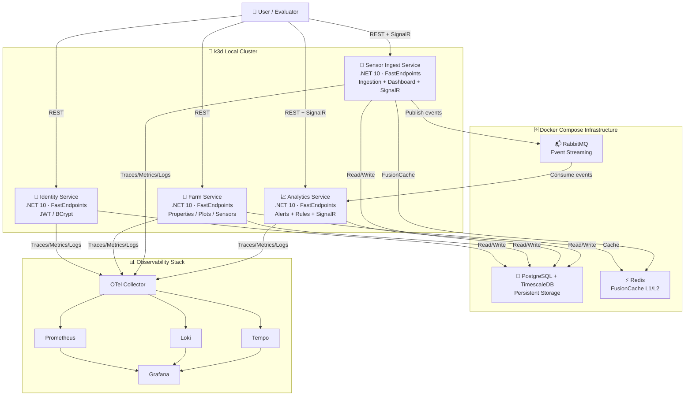

# 🚀 Technical Roadmap - Phase 5: Hackathon 8NETT

## Delivered on Localhost (k3d) • Cloud Migration Planned (Azure)

---

## 🎯 At a Glance

| Aspect         | 🔵 DELIVERED (Localhost / k3d)        | 🟣 FUTURE (Azure Production)              |
| -------------- | ------------------------------------- | ----------------------------------------- |
| **Where?**     | Local k3d cluster (all developers)    | Cloud (post-hackathon)                    |
| **Kubernetes** | k3d (lightweight local cluster)       | AKS (managed Azure service)               |
| **Database**   | PostgreSQL + TimescaleDB (Docker)     | Azure PostgreSQL Flexible Server          |
| **Messaging**  | RabbitMQ (Docker)                     | Azure Service Bus                         |
| **Cache**      | Redis (Docker)                        | Azure Redis Cache                         |
| **Telemetry**  | Prometheus/Grafana/Loki/Tempo/OTel    | Application Insights / Log Analytics      |
| **Cost**       | $0                                    | Azure subscription required               |
| **Status**     | ✅ Delivered (Feb 27, 2026)           | 📋 Architecture documented, not deployed  |

---

## 📊 Delivered Architecture (Localhost - k3d + Docker Compose)



---

## 🎯 1. Context and Objective

**Phase 5 (Delivered):** Build and demonstrate a microservices platform running locally on k3d with complete observability, event-driven architecture, and real-time capabilities.

| Aspect            | Details                                                                           |
| ----------------- | --------------------------------------------------------------------------------- |
| ⏰ Delivered      | **February 27, 2026**                                                             |
| 👥 Team           | **4 backend developers**                                                          |
| 🌍 Environment    | **k3d + Docker Compose (Localhost)**                                              |
| 🎯 Primary Focus  | **realistic, well-architected, observable delivery**                              |
| 📊 Deliverables   | 4 microservices on k3d, observability stack, GitOps via ArgoCD, CI/CD pipelines  |

**What was delivered:**

- ✅ 4 microservices running in k3d Kubernetes
- ✅ Complete observability (Prometheus, Grafana, Loki, Tempo, OpenTelemetry)
- ✅ GitOps workflows with ArgoCD
- ✅ Event-driven architecture with RabbitMQ + Wolverine Outbox Pattern
- ✅ Time-series data with PostgreSQL + TimescaleDB
- ✅ Real-time updates via SignalR (sensor readings + alerts)
- ✅ Sensor data simulation with real weather data (Open-Meteo API)
- ✅ Full alert lifecycle (Pending → Acknowledged → Resolved)

**Post-Hackathon (Future):** Architecture migrates to Azure AKS using Terraform IaC (designed but not deployed during Phase 5).

---

## ⚙️ 2. Assumptions and Constraints

| Assumption                | Description                                                                  |
| ------------------------- | ---------------------------------------------------------------------------- |
| 🎨 Frontend               | No dedicated complex frontend — dashboard via Swagger + SignalR POC          |
| 📊 Data                   | Sensor data simulated via Quartz job + Open-Meteo real weather API           |
| ✅ Evaluation prioritizes | • Architecture<br>• Observability<br>• Infrastructure<br>• Technical clarity |
| 🛑 Avoided                | Full event sourcing, dashboard microservice (absorbed into existing services)|
| 📈 Prioritized            | **Delivered value** and **code quality**                                     |

---

## 🛠️ 3. Technology Stack

### 💾 Backend

```
├── C# / .NET 10
├── FastEndpoints (all services)
├── Pragmatic CQRS with Wolverine
├── EF Core 10
├── FluentValidation
├── Ardalis.Result (Result Pattern)
└── xUnit (testing)
```

### 🗄️ Infrastructure (Localhost)

```
├── k3d (local Kubernetes)
├── Docker Compose (PostgreSQL, Redis, RabbitMQ)
├── PostgreSQL 16 + TimescaleDB (time-series)
├── Redis / FusionCache (L1 + L2 cache)
├── RabbitMQ (async messaging)
└── ArgoCD (GitOps)
```

### 📊 Observability

```
├── OpenTelemetry (traces, metrics, logs)
├── Prometheus (metrics scraping)
├── Grafana (dashboards)
├── Loki (log aggregation)
├── Tempo (distributed tracing)
├── k6 (load tests)
└── GitHub Actions (CI/CD)
```

---

## 🏗️ 4. Architectural Decisions

### 4.1 🔄 Delivered Services

Architecture based on **independent microservices**, each with its own database and git repository.

| Service                          | Port   | Responsibility                                                              |
| -------------------------------- | ------ | --------------------------------------------------------------------------- |
| 🔐 **Identity Service**          | 5001   | Authentication, JWT tokens, user lifecycle, integration events              |
| 🌾 **Farm Service**              | 5002   | Properties, plots (with crop_type), sensors, owner snapshots                |
| 📡 **Sensor Ingest Service**     | 5003   | Ingestion, time-series persistence, dashboard queries, SignalR, simulation  |
| 📈 **Analytics Service**         | 5004   | Alert engine, alert lifecycle, alert queries, SignalR notifications         |

> **Note:** The originally planned `Dashboard Service` was not implemented as a separate microservice. Its responsibilities — dashboard queries, historical reads, and real-time updates — were absorbed into the **Sensor Ingest Service** (readings) and **Analytics Service** (alerts). This was a deliberate pragmatic decision during the final delivery sprint.

---

### 4.2 📝 Pragmatic CQRS

```
┌─────────────────────────────────┐
│         Commands (Write)        │
│   Handlers via Wolverine bus    │
└─────────────────────────────────┘
         ↓
    (no extreme segregation)
         ↓
┌─────────────────────────────────┐
│          Queries (Read)         │
│   ReadStores with Redis cache   │
└─────────────────────────────────┘

🎯 Focus: Clarity and delivery speed
```

---

### 4.3 🗄️ EF Core + TimescaleDB

| Case             | Decision              | Note                            |
| ---------------- | --------------------- | ------------------------------- |
| 🔧 Simple CRUD   | **EF Core**           | All services                    |
| ⏱️ Time series   | EF Core + TimescaleDB | sensor_readings table           |
| 📋 High auditing | Not implemented       | Out of scope for this phase     |

> **Note:** Event sourcing was evaluated and intentionally avoided — it would be overengineering for this scope.

---

## ⏰ 5. Time Series and TimescaleDB

### 5.1 📊 What is Time Series

Data whose primary axis is **time**: sensor readings, continuous metrics, historical dashboards.

```
2026-02-01 10:01 | Sensor-ABC | temp=28.5 | humidity=65.2 | soil=42.1
2026-02-01 10:02 | Sensor-ABC | temp=28.6 | humidity=65.0 | soil=41.9
```

### 5.2 🎯 Why TimescaleDB?

**TimescaleDB is a PostgreSQL extension** that partitions data by time (hypertables), enables fast aggregations, and handles compression natively — without changing how EF Core or SQL works.

| Criterion                                     | Use TimescaleDB?  |
| --------------------------------------------- | ----------------- |
| 🔧 Less than 100k records/day                 | No, Postgres suffices |
| 📊 100k - 10M records/day                     | **YES**           |
| 📈 Needs period aggregations (hour/day/month) | **YES**           |
| 🔍 Needs to query 1+ year of history          | **YES**           |

### 5.3 🔄 Actual data flow

```
Quartz Job (SimulatedSensorReadingsJob)
  → Open-Meteo API (real weather data)
  → SensorReadingAggregate (domain validation)
  → sensor_readings table (PostgreSQL + TimescaleDB)
  → SensorIngestedIntegrationEvent → RabbitMQ
  → Analytics Service (SensorIngestedHandler)
      → AlertAggregate.CreateFromSensorData()
      → alerts table
      → SignalR AlertHub → Dashboard UI
```

Example aggregation query used by the system:

```sql
SELECT
  time_bucket('1 hour', time) AS hour,
  AVG(temperature) AS avg_temp,
  MAX(temperature) AS max_temp,
  MIN(temperature) AS min_temp
FROM sensor_readings
WHERE sensor_id = 'sensor-uuid'
  AND time > now() - interval '7 days'
GROUP BY hour
ORDER BY hour DESC;
```

---

## 📋 6. Database Structure

### 6.1 📊 Tables per Service Database

#### 🔐 Identity Service

- **user_aggregates** (id, email, password_hash, name, username, role, is_active)
- Wolverine Outbox tables (transactional event publishing)

#### 🌾 Farm Service

- **property_aggregates** (id, name, address, coordinates, area_hectares, owner_id)
- **plot_aggregates** (id, property_id, name, crop_type, area_hectares)
- **sensor_aggregates** (id, plot_id, label, type, operational_status)
- **owner_snapshots** (denormalized from Identity events)
- Wolverine Outbox tables

#### 📡 Sensor Ingest Service

- **sensor_readings** (id, sensor_id, time `timestamptz`, temperature, humidity, soil_moisture, rainfall, battery_level) — indexed on `(sensor_id, time)`
- **sensor_snapshots** (denormalized from Farm events)
- **owner_snapshots** (denormalized from Identity events)

#### 📈 Analytics Service

- **alerts** (id, sensor_id, type, severity, status, message, value, threshold, acknowledged_at, resolved_at)
- **sensor_snapshots** (denormalized from Farm events)
- **owner_snapshots** (denormalized from Identity events)

### 6.2 🔌 Delivered Endpoints

#### 🔐 Identity Service (`localhost:5001`)

```
POST   /auth/register          → Create user + JWT token
POST   /auth/login             → JWT token
POST   /auth/refresh           → Refresh token
GET    /users/{id}             → Get user
PUT    /users/{id}             → Update user
POST   /users/{id}/deactivate  → Deactivate user
POST   /users/{id}/change-password
GET    /users                  → List users (Admin)
```

#### 🌾 Farm Service (`localhost:5002`)

```
POST   /api/properties               → Create property
GET    /api/properties               → List properties (paginated)
GET    /api/properties/{id}          → Get property
PUT    /api/properties/{id}          → Update property
GET    /api/properties/{id}/plots    → List plots of a property

POST   /api/plots                    → Create plot
GET    /api/plots                    → List plots (paginated)
GET    /api/plots/{id}               → Get plot
GET    /api/plots/{id}/sensors       → List sensors of a plot

POST   /api/sensors                  → Register sensor
GET    /api/sensors                  → List sensors (paginated)
GET    /api/sensors/{id}             → Get sensor
PUT    /api/sensors/{id}/status-change → Change operational status
DELETE /api/sensors/{id}             → Deactivate sensor (soft-delete)

GET    /api/owners                   → List active owners
```

#### 📡 Sensor Ingest Service (`localhost:5003`)

```
# Ingestion (JWT required)
POST   /readings                     → Ingest single reading → 202 Accepted
POST   /readings/batch               → Ingest batch of readings → 202 Accepted

# Dashboard queries (JWT required)
GET    /dashboard/latest             → Latest readings, paginated + cached
GET    /sensors/{id}/readings/history → Reading history by sensor (up to 30 days)

# Real-time
WS     /dashboard/sensorshub        → SignalR Hub (live readings)
```

#### 📈 Analytics Service (`localhost:5004`)

```
# Alert queries (JWT required)
GET    /alerts/pending               → Pending alerts, paginated + cached
GET    /alerts/history               → Alert history (paginated)
GET    /alerts/summary               → Summary counts by severity/status
GET    /sensors/{id}/status          → Aggregated sensor status from alerts

# Alert lifecycle (JWT required)
POST   /alerts/{id}/acknowledge      → Acknowledge alert
POST   /alerts/{id}/resolve          → Resolve alert with optional notes

# Real-time
WS     /alertshub                    → SignalR Hub (live alert notifications)
```

---

## 🎯 7. Critical Architectural Decisions (ADRs)

- [ADR-001: Microservices-based Architecture](docs/adr/ADR-001-microservices.md)
- [ADR-002: Data Persistence Strategy](docs/adr/ADR-002-persistence.md)
- [ADR-003: Use of Time Series with TimescaleDB](docs/adr/ADR-003-timeseries.md)
- [ADR-004: Observability and Dashboards](docs/adr/ADR-004-observability.md)
- [ADR-005: Local vs Cloud Development Strategy](docs/adr/ADR-005-local-vs-cloud.md)
- [ADR-006: Local Orchestration – .NET Aspire vs Docker Compose](docs/adr/ADR-006-local-orchestration.md)
- [ADR-007: AKS Node Pool Strategy](docs/adr/ADR-007-node-pool-strategy.md)

---

## 🏗️ 8. C4 Diagrams

- [C4 Level 1: Context Diagram](docs/architecture/c4-context.md)
- [C4 Level 2: Container Diagram](docs/architecture/c4-container.md)

---

## 📅 9. Delivery Summary by Phase

### ✅ Phase 0 – Structure and Setup

- ✅ Multi-repo structure (one git repo per service)
- ✅ GitHub Actions CI/CD pipelines (build, test, push to Docker Hub)
- ✅ Coding conventions, EditorConfig, Central Package Management
- ✅ Local development setup (Docker Compose + k3d)
- ✅ Initial documentation (READMEs, ADRs, C4 diagrams)

### ✅ Phase 1 – Domain and Database Schema

- ✅ Domain models: Property, Plot, Sensor, User, Alert, SensorReading
- ✅ DDD Aggregates with Value Objects and Domain Events
- ✅ EF Core DbContext + migrations for all services
- ✅ TimescaleDB enabled on sensor_readings table
- ✅ FastEndpoints configured in all services

### ✅ Phase 2 – Ingestion and Performance

- ✅ Single and batch ingestion endpoints
- ✅ Domain validation in `SensorReadingAggregate` (range limits, at-least-one-metric rule)
- ✅ Indexes on `(sensor_id, time)` for fast time-series queries
- ✅ FusionCache (L1 memory + L2 Redis) for hot query caching
- ✅ `SimulatedSensorReadingsJob` (Quartz) generating continuous realistic data
- ✅ Open-Meteo API integration for real weather data in simulation

### ✅ Phase 3 – Alert Engine and Queries

- ✅ `SensorIngestedHandler` consuming RabbitMQ events via Wolverine
- ✅ `AlertAggregate.CreateFromSensorData()` evaluating rules:
  - Temperature > configurable threshold → `HighTemperature` alert
  - Soil moisture < configurable threshold → `LowSoilMoisture` alert
  - Battery level < configurable threshold → `LowBattery` alert
  - Severity scales proportionally to deviation from threshold (Low/Medium/High/Critical)
- ✅ Alert lifecycle: `Pending → Acknowledged → Resolved`
- ✅ Dashboard queries: latest readings, reading history, pending alerts, alert history
- ✅ Plot/sensor status derived from active alert state

### ✅ Phase 4 – Patterns, Observability, Testing

- ✅ CQRS with Wolverine (Commands + Queries separated)
- ✅ Outbox Pattern for transactional event publishing
- ✅ Snapshot Pattern (OwnerSnapshot, SensorSnapshot) for cross-service data
- ✅ FluentValidation on all endpoints
- ✅ Result Pattern (Ardalis.Result) — no exceptions for business errors
- ✅ OpenTelemetry instrumentation: traces, metrics, structured logs
- ✅ Correlation ID propagation across all services
- ✅ Custom Prometheus metrics per service
- ✅ 700+ unit tests across all services (identity: 56, farm: 247, ingest: 241, analytics: 170+)

### ✅ Phase 5 – Real-Time, Integration, GitOps

- ✅ SignalR hubs: `SensorHub` (live readings) + `AlertHub` (live alerts)
- ✅ ArgoCD GitOps managing all services in k3d
- ✅ Health checks: `/health`, `/ready`, `/live` on all services
- ✅ Metrics endpoints: `/metrics` (Prometheus format) on all services
- ✅ Swagger/OpenAPI documented on all APIs
- ✅ k6 load tests for ingestion pipeline

---

## 📊 10. Service Details

### 🔐 Identity Service

**Responsibility:** Authentication, authorization, user lifecycle

**Stack:** FastEndpoints · JWT Bearer · BCrypt · EF Core + PostgreSQL · Wolverine Outbox · OpenTelemetry

**Published events:** `UserCreatedIntegrationEvent`, `UserUpdatedIntegrationEvent`, `UserDeactivatedIntegrationEvent`

**Domain highlights:** `UserAggregate` with Value Objects (`Email`, `Password`, `Role`), full DDD lifecycle

---

### 🌾 Farm Service

**Responsibility:** Agricultural resource management (properties, plots, sensors)

**Stack:** FastEndpoints · EF Core + PostgreSQL · FusionCache + Redis · Wolverine · OpenTelemetry

**Published events:** `PropertyCreatedIntegrationEvent`, `PropertyUpdatedIntegrationEvent`, `PlotCreatedIntegrationEvent`, `SensorRegisteredIntegrationEvent`, `SensorOperationalStatusChangedIntegrationEvent`, `SensorDeactivatedIntegrationEvent`

**Consumed events:** `UserRegisteredIntegrationEvent`, `UserUpdatedIntegrationEvent`, `UserDeactivatedIntegrationEvent` → maintains `OwnerSnapshot`

**Domain highlights:** 3 aggregates (`PropertyAggregate`, `PlotAggregate`, `SensorAggregate`), `SensorOperationalStatus` value object (Active/Maintenance/Faulty/Inactive)

---

### 📡 Sensor Ingest Service

**Responsibility:** Sensor data ingestion, time-series persistence, dashboard reads, real-time updates, data simulation

**Stack:** FastEndpoints · EF Core + PostgreSQL/TimescaleDB · FusionCache + Redis · Wolverine Outbox · Quartz · SignalR · OpenTelemetry

**Published events:** `SensorIngestedIntegrationEvent`

**Consumed events:** `SensorRegisteredIntegrationEvent`, `SensorOperationalStatusChangedIntegrationEvent`, `SensorDeactivatedIntegrationEvent` → maintains `SensorSnapshot`

**Notable features:**
- `SimulatedSensorReadingsJob` (Quartz): generates readings for all active sensors on a configurable interval
- `OpenMeteoWeatherProvider`: fetches real weather data (temperature, humidity, soil moisture, precipitation) with 60-minute cache; falls back to `Bogus`-generated data when API is unavailable
- `SensorHub` (SignalR): pushes live readings to connected clients

**Domain highlights:** `SensorReadingAggregate` with validation (range limits, at-least-one-metric, no future timestamps)

---

### 📈 Analytics Service

**Responsibility:** Alert detection, alert lifecycle management, alert queries, real-time notifications

**Stack:** FastEndpoints · EF Core + PostgreSQL · FusionCache + Redis · Wolverine · SignalR · OpenTelemetry

**Consumed events:** `SensorIngestedIntegrationEvent` → evaluates alert rules · `SensorRegisteredIntegrationEvent`, `SensorDeactivatedIntegrationEvent` → maintains `SensorSnapshot`

**Alert rules (configurable thresholds):**

| Metric        | Condition          | Alert Type       | Severity logic                              |
| ------------- | ------------------ | ---------------- | ------------------------------------------- |
| Temperature   | > MaxTemperature   | `HighTemperature`| Low/Medium/High/Critical by deviation °C   |
| Soil Moisture | < MinSoilMoisture  | `LowSoilMoisture`| Low/Medium/High/Critical by deficit %      |
| Battery Level | < MinBatteryLevel  | `LowBattery`     | Low/Medium/High/Critical by level %        |

**Domain highlights:** `AlertAggregate` with full lifecycle, domain events per state transition, metadata JSON storing sensor context at time of alert

**Notable features:**
- `AlertHub` (SignalR): pushes live alert notifications to connected clients
- Alert queries include `ownerId` scoping (Producers see only their alerts; Admins see all)

---

## 🚀 11. Infrastructure

### 11.1 Local Stack (Delivered)

```yaml
# docker-compose: infrastructure services
services:
  postgres:    # PostgreSQL 16 + TimescaleDB
  redis:       # Redis 7
  rabbitmq:    # RabbitMQ 4 with management UI
  prometheus:  # Metrics collection
  grafana:     # Dashboards (Loki + Tempo + Prometheus)
  loki:        # Log aggregation
  tempo:       # Distributed tracing
  otel-collector: # OpenTelemetry collector
```

```powershell
# k3d cluster
cd scripts/k3d
.\bootstrap.ps1          # Create cluster + ArgoCD
.\port-forward.ps1 argocd
.\build-push-images.ps1  # Build + push to Docker Hub (rdpresser)
.\status.ps1
```

### 11.2 CI/CD (GitHub Actions)

Each service repository has its own pipeline:

```yaml
# On push to main:
# 1. dotnet test (all tests must pass)
# 2. docker build
# 3. docker push → Docker Hub (rdpresser/tc-agro-*)
# 4. ArgoCD detects new image → deploys to k3d
```

### 11.3 GitOps (ArgoCD)

ArgoCD monitors `infrastructure/kubernetes/apps/` and reconciles deployments for all 4 services automatically.

```
infrastructure/kubernetes/
├── apps/
│   ├── base/
│   │   ├── identity/
│   │   ├── farm/
│   │   ├── sensor-ingest/
│   │   └── analytics-worker/
│   └── overlays/
└── platform/
    ├── base/ (ingress, namespaces, otel-daemonset)
    └── overlays/
```

### 11.4 🟣 Future: Azure (Post-Hackathon)

The architecture was designed to migrate to Azure with minimal changes:

| Component         | Local                 | Azure (Future)                   |
| ----------------- | --------------------- | -------------------------------- |
| Kubernetes        | k3d                   | AKS (3 node pool strategy)       |
| Database          | PostgreSQL + TSdb      | Azure PostgreSQL Flexible Server |
| Messaging         | RabbitMQ              | Azure Service Bus                |
| Cache             | Redis                 | Azure Redis Cache                |
| Observability     | Prometheus/Grafana    | Application Insights             |
| IaC               | —                     | Terraform (modules designed)     |

See [ADR-007](docs/adr/ADR-007-node-pool-strategy.md) for AKS node pool strategy and [ADR-005](docs/adr/ADR-005-local-vs-cloud.md) for the local vs cloud rationale.

---

## 📈 12. Observability

### 12.1 What is instrumented

Every service exposes:
- **`/metrics`** — Prometheus format (HTTP request counts, latencies, GC, thread pool)
- **`/health`** — overall health
- **`/ready`** — readiness probe (DB + Redis connectivity)
- **`/live`** — liveness probe

Custom metrics per service:
- Sensor Ingest: ingestion rate, cache hit/miss ratio, simulation job execution
- Analytics: alerts generated per type/severity, alert processing latency
- Farm: property/plot/sensor registration rates
- Identity: login attempts, token generation latency

### 12.2 Distributed Tracing

- W3C Trace Context propagation across all HTTP calls and RabbitMQ messages
- `X-Correlation-Id` header propagated by `CorrelationMiddleware` in all services
- Traces visible in Grafana Tempo, correlated with logs in Loki

### 12.3 Grafana Access (Local)

```
Grafana:            http://localhost:3000  (admin/admin)
Prometheus:         http://localhost:9090
RabbitMQ UI:        http://localhost:15672 (guest/guest)
ArgoCD:             http://localhost:8090/argocd/ (admin/Argo@123!)
```

---

## ✅ Mandatory Deliverables (Hackathon 8NETT)

| Deliverable | Status |
|---|---|
| Architecture diagram + decision rationale (ADRs) | ✅ Delivered |
| Kubernetes evidence (k3d) + observability (Grafana/Loki/Tempo) | ✅ Delivered |
| CI/CD pipelines with green checks (GitHub Actions + Docker Hub) | ✅ Delivered |
| Producer auth, property/plot registration, authenticated sensor ingestion | ✅ Delivered |
| Dashboard with historical data + plot status from alert rules | ✅ Delivered |
| Alert engine + alert visibility | ✅ Delivered |
| Demo video (≤ 15 min) | ✅ Delivered |
| Public repositories | ✅ Delivered |
| Delivery report (PDF) | ✅ Delivered |

---

## 📚 Documentation Structure

```
/docs
├── adr/                    # Architectural Decision Records (ADR-001 to ADR-007)
├── architecture/           # C4 diagrams, data model, deployment
├── development/            # Local setup guide
└── domain/                 # Domain glossary
```

**Quick Links:**
- **Local Setup:** [docs/development/local-setup.md](docs/development/local-setup.md)
- **Architecture:** [C4 Context](docs/architecture/c4-context.md) | [C4 Container](docs/architecture/c4-container.md)
- **ADRs:** [docs/adr/](docs/adr/)
- **Requirements Mapping:** [docs/REQUIREMENTS_MAPPING.md](docs/REQUIREMENTS_MAPPING.md)
- **New Service Template:** [NEW_MICROSERVICE_TEMPLATE.md](NEW_MICROSERVICE_TEMPLATE.md)

---

## ✨ Final Summary

✅ **4 microservices delivered** — Identity, Farm, Sensor Ingest, Analytics  
✅ **Event-driven** — RabbitMQ + Wolverine Outbox Pattern across all services  
✅ **Real-time** — SignalR hubs for live sensor readings and live alerts  
✅ **Observable** — OpenTelemetry + Prometheus + Grafana + Loki + Tempo  
✅ **Tested** — 700+ unit tests, 82–94% coverage across services  
✅ **GitOps** — ArgoCD managing all deployments in k3d  
✅ **Production-ready patterns** — DDD, CQRS, Outbox, Snapshot, Result Pattern  

**Delivered:** February 27, 2026 · **Team:** 4 backend developers · **Platform:** k3d + Docker Compose

---

> **Version 4.0** — Updated to reflect what was actually built and delivered.
