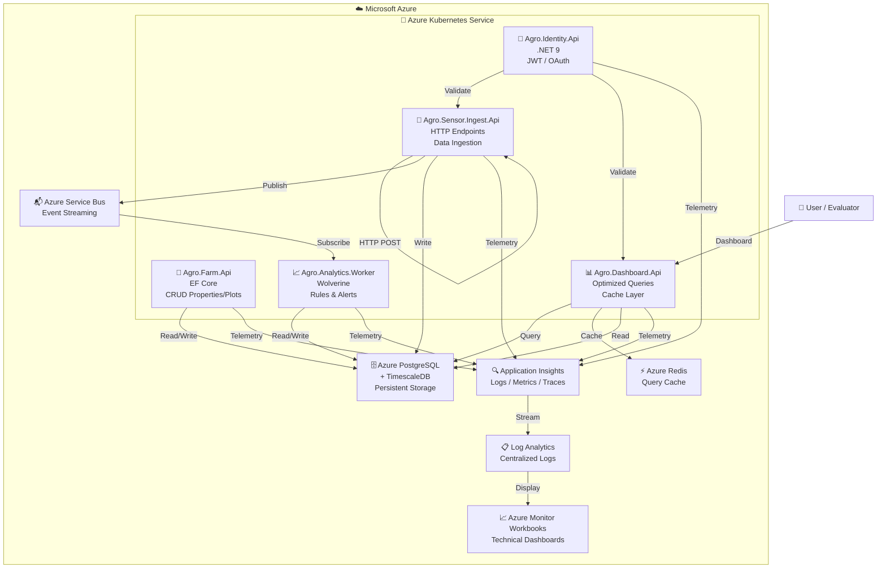

# C4 Level 2: Container Diagram

**What it communicates:**
- ✅ Well-defined containers (services, infra, observability)
- ✅ Clear data flow
- ✅ Full telemetry integration
- ✅ Separation of responsibilities
- ✅ Per-service scalability
