# C4 Level 2: Container Diagram

```mermaid
graph TB
    User["👤 User / Evaluator"]

    subgraph Azure["☁️ Microsoft Azure"]
        subgraph AKS["🐳 Azure Kubernetes Service"]
            Identity["🔐 Agro.Identity.Api<br/>.NET 9<br/>JWT / OAuth"]
            Farm["🌾 Agro.Farm.Api<br/>EF Core<br/>CRUD Properties/Plots"]
            Ingest["📡 Agro.Sensor.Ingest.Api<br/>HTTP Endpoints<br/>Data Ingestion"]
            Analytics["📈 Agro.Analytics.Worker<br/>Wolverine<br/>Rules & Alerts"]
            Dashboard["📊 Agro.Dashboard.Api<br/>Optimized Queries<br/>Cache Layer"]
        end

        Messaging["📬 Azure Service Bus<br/>Event Streaming"]
        Database["🗄️ Azure PostgreSQL<br/>+ TimescaleDB<br/>Persistent Storage"]
        Cache["⚡ Azure Redis<br/>Query Cache"]
        Telemetry["🔍 Application Insights<br/>Logs / Metrics / Traces"]
        Analytics_Svc["📋 Log Analytics<br/>Centralized Logs"]
        Workbooks["📈 Azure Monitor Workbooks<br/>Technical Dashboards"]
    end

    User -->|Dashboard| Dashboard
    Dashboard -->|Query| Database
    Dashboard -->|Cache| Cache
    
    Ingest -->|HTTP POST| Ingest
    Ingest -->|Publish| Messaging
    Messaging -->|Subscribe| Analytics
    
    Identity -->|Validate| Ingest
    Identity -->|Validate| Dashboard
    
    Farm -->|Read/Write| Database
    Ingest -->|Write| Database
    Analytics -->|Read/Write| Database
    Dashboard -->|Read| Database
    
    Identity -->|Telemetry| Telemetry
    Farm -->|Telemetry| Telemetry
    Ingest -->|Telemetry| Telemetry
    Analytics -->|Telemetry| Telemetry
    Dashboard -->|Telemetry| Telemetry
    
    Telemetry -->|Stream| Analytics_Svc
    Analytics_Svc -->|Display| Workbooks
```

**What it communicates:**
- ✅ Well-defined containers (services, infra, observability)
- ✅ Clear data flow
- ✅ Full telemetry integration
- ✅ Separation of responsibilities
- ✅ Per-service scalability
