# C4 Level 2: Container Diagram

```mermaid
graph TB
    User["👤 User / Evaluator"]

    subgraph Azure["☁️ Microsoft Azure"]
        subgraph AKS["🐳 Azure Kubernetes Service"]
            Identity["🔐 Agro.Identity.Api<br/>.NET 9<br/>JWT / OAuth"]
            Farm["🌾 Agro.Farm.Api<br/>EF Core<br/>CRUD Properties/Plots"]
            Ingest["📡 Agro.Sensor.Ingest.Api<br/>HTTP Endpoints<br/>Data Ingestion"]
            Analytics["📈 Agro.Analytics.Worker<br/>Wolverine<br/>Rules & Alerts"]
            Dashboard["📊 Agro.Dashboard.Api<br/>Optimized Queries<br/>Cache Layer"]
        end

        Messaging["📬 Azure Service Bus<br/>Event Streaming"]
        Database["🗄️ Azure PostgreSQL<br/>+ TimescaleDB<br/>Persistent Storage"]
        Cache["⚡ Azure Redis<br/>Query Cache"]
        Telemetry["🔍 Application Insights<br/>Logs / Metrics / Traces"]
        Analytics_Svc["📋 Log Analytics<br/>Centralized Logs"]
        Workbooks["📈 Azure Monitor Workbooks<br/>Technical Dashboards"]
    end

    User -->|Dashboard| Dashboard
    Dashboard -->|Query| Database
    Dashboard -->|Cache| Cache
    
    Ingest -->|HTTP POST| Ingest
    Ingest -->|Publish| Messaging
    Messaging -->|Subscribe| Analytics
    
    Identity -->|Validate| Ingest
    Identity -->|Validate| Dashboard
    
    Farm -->|Read/Write| Database
    Ingest -->|Write| Database
    Analytics -->|Read/Write| Database
    Dashboard -->|Read| Database
    
    Identity -->|Telemetry| Telemetry
    Farm -->|Telemetry| Telemetry
    Ingest -->|Telemetry| Telemetry
    Analytics -->|Telemetry| Telemetry
    Dashboard -->|Telemetry| Telemetry
    
    Telemetry -->|Stream| Analytics_Svc
    Analytics_Svc -->|Display| Workbooks
```

## 🔵 CURRENT (Localhost - k3d + Docker Compose)

**Components:**
- **k3d Cluster:** 4 nodes (1 server + 3 agents) running Kubernetes locally
- **Microservices:** 5 APIs + 1 worker in agro-apps namespace
- **Infrastructure:** ArgoCD (GitOps), Traefik (ingress)
- **Docker Compose:** All backing services (DB, cache, messaging, observability)

---

## 🟣 FUTURE (Azure - Post-Hackathon)

**Components (same architecture as localhost, but using Azure managed services):**
- **AKS Cluster:** Managed Kubernetes service
- **Microservices:** Same 5 APIs + 1 worker
- **Managed Services:** PostgreSQL, Service Bus, Redis, App Insights
- **Observability:** Application Insights + Workbooks (instead of Prometheus/Grafana/Loki)
- ✅ Well-defined containers (services, infra, observability)
- ✅ Clear data flow
- ✅ Full telemetry integration
- ✅ Separation of responsibilities
- ✅ Per-service scalability
