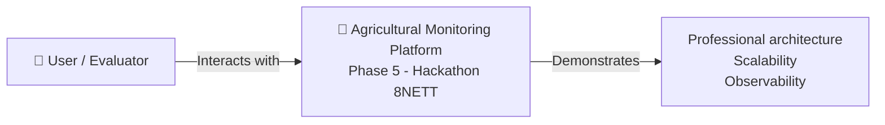

# C4 Level 1: Context Diagram

```mermaid
graph LR
    User["👤 User / Evaluator"]
    System["🚀 Agricultural Monitoring Platform<br/>Phase 5 - Hackathon 8NETT"]
    
    User -->|Interacts with| System
    System -->|Demonstrates| Architecture["Professional architecture<br/>Scalability<br/>Observability"]
```

**What it communicates:**
- ✅ Single, cohesive system
- ✅ External user (evaluator)
- ✅ Clear and defined scope
