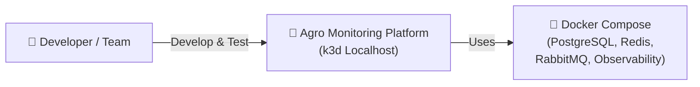
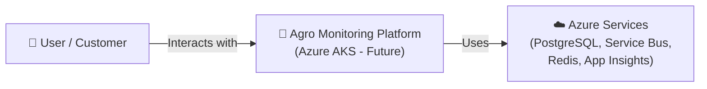

# C4 Level 1: Context Diagram

## 🔵 CURRENT (Localhost - k3d)

**What it communicates:**

- ✅ Development happens on localhost
- ✅ k3d cluster with all services
- ✅ Docker Compose backing services
- ✅ Complete observability locally

---

## 🟣 FUTURE (Azure - Post-Hackathon)

**What it communicates:**

- ✅ Production deployment on Azure
- ✅ Managed services for scalability
- ✅ Full observability via Application Insights
- ✅ Target for post-hackathon migration
