# C4 Level 1: Context Diagram

## 🔵 CURRENT (Localhost - k3d)

```mermaid
graph LR
    Dev["👤 Developer / Team"]
    System["🌾 Agro Monitoring Platform<br/>(k3d Localhost)"]
    LocalCompose["🐳 Docker Compose<br/>(PostgreSQL, Redis,<br/>RabbitMQ, Observability)"]

    Dev -->|Develop & Test| System
    System -->|Uses| LocalCompose
```

**What it communicates:**

- ✅ Development happens on localhost
- ✅ k3d cluster with all services
- ✅ Docker Compose backing services
- ✅ Complete observability locally

---

## 🟣 FUTURE (Azure - Post-Hackathon)

```mermaid
graph LR
    User["👤 User / Customer"]
    System["🌾 Agro Monitoring Platform<br/>(Azure AKS - Future)"]
    Azure["☁️ Azure Services<br/>(PostgreSQL, Service Bus,<br/>Redis, App Insights)"]

    User -->|Interacts with| System
    System -->|Uses| Azure
```

**What it communicates:**

- ✅ Production deployment on Azure
- ✅ Managed services for scalability
- ✅ Full observability via Application Insights
- ✅ Target for post-hackathon migration
