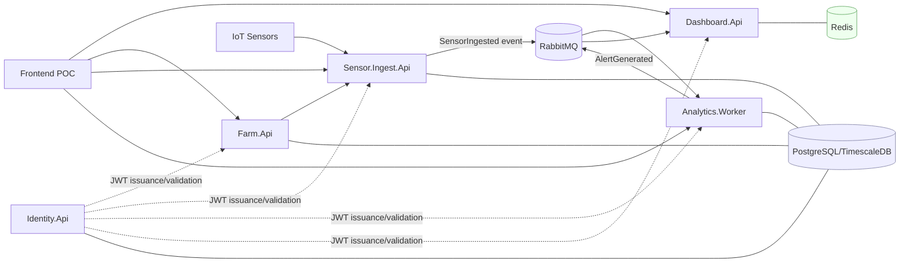
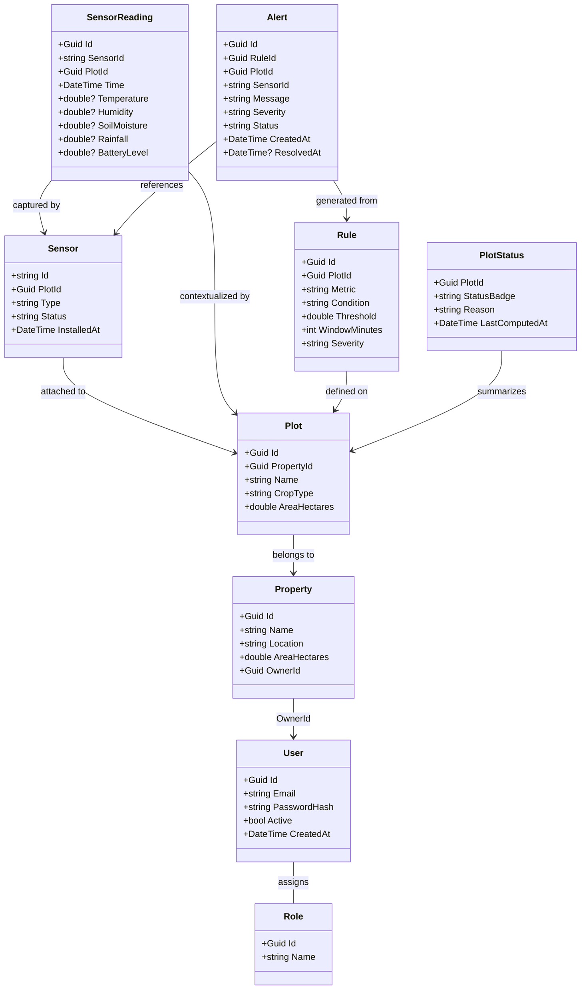

# Domain Map and API Ownership

Purpose: clarify ownership, entities, and relationships across the microservices for the Hackathon scope. This version is simplified for localhost execution with:

- Infrastructure in Docker Compose
- Applications in a local k3d cluster
- GitOps deployment via ArgoCD

## High-Level Domains

- Identity.Api: authentication and authorization
- Farm.Api: system topology and sensor registration
- Sensor.Ingest.Api: time-series ingestion and reading storage
- Analytics.Worker: rule evaluation and alert generation
- Dashboard.Api: read-optimized API for frontend (optional for hackathon)
  - For hackathon simplicity, dashboard endpoints may live inside Sensor.Ingest.Api

## Service Repositories (Current Workspace)

- services/identity-service
- services/farm-service
- services/sensor-ingest-service
- services/analytics-worker
- services/dashboard-service

These repositories represent the current microservice landscape for this solution.

## Core Entities (per service)

- Identity.Api
  - User (Id, Email, PasswordHash, Status, CreatedAt)
  - Role (Id, Name)
  - UserRole (UserId, RoleId)
  - AuthToken (JWT payload: sub, email, roles, exp)

- Farm.Api
  - Producer (Id, Name, Email)
  - Property (Id, Name, Location, AreaHectares, OwnerId)
  - Plot (Id, PropertyId, Name, CropType, AreaHectares)
  - Sensor (Id, PlotId, Type, Status, InstalledAt)
  - Source of truth for: SensorId, PlotId, PropertyId

- Sensor.Ingest.Api
  - SensorReading (Id, SensorId, PlotId, Time, Temperature, Humidity, SoilMoisture, Rainfall, BatteryLevel?)
  - Stored in TimescaleDB hypertable `sensor_readings` (indexed on sensor_id, time)
  - Responsibilities: ingest readings, persist time-series data, expose history, publish ingestion events

- Analytics.Worker
  - Rule (Id, PlotId, Metric, Condition, Threshold, WindowMinutes, Severity)
  - Alert (Id, RuleId, PlotId, SensorId, Message, Severity, Status, CreatedAt, ResolvedAt?)
  - Responsibilities: consume ingestion events, evaluate rules, generate alerts

- Dashboard.Api (optional)
  - PlotStatus, AlertView, ReadingAggregate, LatestReadingView, DashboardStats
  - Responsibilities: aggregate data from other services, provide cached read models

## Infrastructure Layout (Localhost)

Docker Compose runs outside the cluster:

- PostgreSQL (Farm, Identity, Analytics)
- TimescaleDB (Sensor readings)
- Redis (cache)
- RabbitMQ (events)
- Grafana stack (observability)
- OpenTelemetry collector

k3d runs application workloads:

- Identity.Api
- Farm.Api
- Sensor.Ingest.Api
- Analytics.Worker
- Dashboard.Api (optional)
- ArgoCD

## Relationships and Data Flow

Write side:

- Identity -> Farm -> Sensor.Ingest -> Analytics
  - Identity manages users
  - Farm manages properties, plots, and sensors
  - Sensors send readings to Sensor.Ingest
  - Sensor.Ingest publishes events
  - Analytics consumes events and creates alerts

Read side (hackathon mode):

- Frontend reads directly from services
  - Farm.Api (topology)
  - Sensor.Ingest.Api (readings)
  - Analytics.Worker (alerts)
  - Dashboard.Api is optional

Each service owns its own database. No shared tables across services.

## Mermaid Bounded Contexts

## Mermaid Overview

## Events and Contracts (suggested)

- SensorIngested (ReadingId, SensorId, PlotId, Time, Metrics...)
- AlertGenerated (AlertId, PlotId, SensorId, Severity, Message, CreatedAt)
- AlertResolved (AlertId, PlotId, ResolvedAt)
- SensorRegistered (SensorId, PlotId, Type, Status)

## Service Responsibilities Summary

| Service           | Owns Data                  |
| ----------------- | -------------------------- |
| Identity.Api      | Users, roles               |
| Farm.Api          | Properties, plots, sensors |
| Sensor.Ingest.Api | Time-series readings       |
| Analytics.Worker  | Rules and alerts           |
| Dashboard.Api     | Read models (optional)     |

## How to Read the Model

- Write side: Identity -> Farm -> Sensor.Ingest -> Analytics
- Read side: Dashboard.Api (or frontend) aggregates read models
- Each service owns its own database; no shared tables
