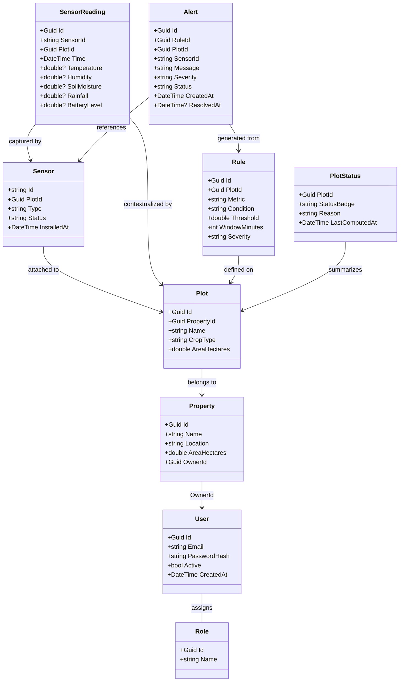

# Domain Map and API Ownership

Purpose: clarify ownership, entities, and relationships across the microservices for the Hackathon 8NETT scope. All names align with the existing roadmap, ADRs, and the frontend POC in `poc/frontend`.

## High-Level Domains

- Identity.Api: Users, roles, authentication, JWT issuance.
- Farm.Api: Producers, properties, plots (with crop type), sensors registry.
- Sensor.Ingest.Api: Time-series readings ingestion (TimescaleDB hypertable) and event publication.
- Analytics.Worker: Rule evaluation and alert generation over readings.
- Dashboard.Api: Read-optimized projections, aggregates, and alert/status views for UI.

## Core Entities (per service)

- Identity.Api

  - User (Id, Email, PasswordHash, Status, CreatedAt)
  - Role (Id, Name)
  - UserRole (UserId, RoleId)
  - AuthToken (JWT payload: sub, email, roles, exp)

- Farm.Api

  - Producer (Id, Name, Email) // optional for ownership grouping
  - Property (Id, Name, Location, AreaHectares, OwnerId)
  - Plot (Id, PropertyId, Name, CropType, AreaHectares)
  - Sensor (Id, PlotId, Type, Status, InstalledAt)

- Sensor.Ingest.Api

  - SensorReading (Id, SensorId, PlotId, Time, Temperature, Humidity, SoilMoisture, Rainfall, BatteryLevel?)
    - Stored as TimescaleDB hypertable `sensor_readings` (indexed on sensor_id, time; time_bucket for aggregations)
  - IngestEvent (ReadingId, SensorId, PlotId, Time)

- Analytics.Worker

  - Rule (Id, PlotId, Metric, Condition, Threshold, WindowMinutes, Severity)
  - Alert (Id, RuleId, PlotId, SensorId, Message, Severity, Status, CreatedAt, ResolvedAt?)
  - RuleEvaluationWindow (materialized window to track 24h breaches, etc.)

- Dashboard.Api
  - PlotStatus (PlotId, StatusBadge, LastComputedAt, Reason)
  - AlertView (AlertId, PlotId, SensorId, Severity, Status, CreatedAt)
  - ReadingAggregate (SensorId, Interval, AvgTemp, MaxTemp, MinTemp, AvgHumidity, AvgSoil)
  - LatestReadingView (SensorId, PlotId, Time, Temperature, Humidity, SoilMoisture, BatteryLevel?)
  - DashboardStats (Properties, Plots, Sensors, AlertsOpen)

## Relationships and Data Flow

- Identity owns users and roles; all APIs enforce JWT from Identity.
- Farm owns the catalog of properties, plots, and sensors; Sensor.Id and PlotId originate here.
- Sensor.Ingest persists readings and emits IngestEvent to Service Bus.
- Analytics.Worker consumes IngestEvent, applies Rule over recent readings, and creates Alert.
- Dashboard.Api queries:
  - Farm for topology (properties/plots/sensors)
  - Sensor.Ingest DB for history/aggregates
  - Analytics DB for alerts/status
  - Redis caches hot queries

## Mermaid Overview

## Service Responsibilities and Ownership

- Identity.Api: source of truth for authentication/authorization; emits user-related events if needed.
- Farm.Api: source of truth for topology; Sensor.Id/PlotId/PropertyId originate here.
- Sensor.Ingest.Api: owns time-series storage and schema; publishes ingestion events.
- Analytics.Worker: owns rules and alerts; writes to its own DB; can publish AlertGenerated events.
- Dashboard.Api: owns read models/caches; does not own canonical data; subscribes/queries others.

## Events and Contracts (suggested)

- SensorIngested (ReadingId, SensorId, PlotId, Time, Metrics...)
- AlertGenerated (AlertId, PlotId, SensorId, Severity, Message, CreatedAt)
- AlertResolved (AlertId, PlotId, ResolvedAt)
- SensorRegistered (SensorId, PlotId, Type, Status)
- PlotUpdated (PlotId, PropertyId, CropType, AreaHectares)

## Alignment with Frontend POC (poc/frontend)

- `dashboard.html`: map to Dashboard.Api endpoints `GET /dashboard/stats`, `GET /dashboard/latest`, `GET /dashboard/history/{sensorId}`.
- `properties*.html` and `plots*.html`: map to Farm.Api CRUD for properties/plots; ensure CropType is mandatory and displayed.
- `sensors.html`: map to Farm.Api sensors listing and Sensor.Ingest history per sensor; surface status badges from PlotStatus/Alert.
- `alerts.html`: map to Analytics alerts list and resolution endpoint.

## Suggested Frontend Improvements (keep mock-ready)

1. Surface plot status badge (e.g., OK/Warning/Critical) using Dashboard.Api PlotStatus; show reason text.
2. Add sensor health indicators (battery level, last seen timestamp) fed by Sensor.Ingest latest reading.
3. In history charts, expose selectable metric (temperature, humidity, soil moisture) and interval (1h, 24h, 7d) aligning with time_bucket queries.
4. In properties/plots forms, enforce CropType selection and show attached sensors count; this matches mandatory crop_type in ADR-002.
5. Alerts page: add filter by severity/status and a Resolve action that calls Analytics alert resolution.
6. Add a small legend on dashboard cards clarifying data freshness (e.g., updated_at from latest reading).

## How to Read the Model

- Write side: Identity -> Farm (topology) -> Sensor.Ingest (readings) -> Analytics (alerts).
- Read side: Dashboard consumes Farm topology + Sensor.Ingest aggregates + Analytics alerts, exposes cached views for UI.
- Each service owns its persistence; cross-service reads happen via HTTP/queries or subscribed events; no shared tables.
